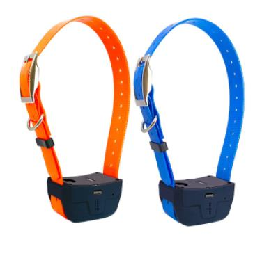

# GOTOP - A12

The GOTOP A12 is a specialized GPS tracker designed specifically for animal tracking. With its included collar, it is the perfect solution for keeping tabs on your pets or other animals. The tracker is equipped with a built-in motion sensor, allowing you to receive alerts whenever your animal is on the move. Additionally, the A12 is waterproof with an IPX7 rating, ensuring that it can withstand any outdoor conditions.

Measuring at 84x47x45mm and weighing just 145g, the A12 is compact and lightweight, making it comfortable for your animal to wear. It operates on the GSM band, with support for 850/900/1800/1900 frequencies. The tracker offers real-time tracking through GPRS, allowing you to monitor your animal's location at any given moment. It also provides a history route tracking feature, so you can review where your animal has been over a specific period of time.

The A12 offers multiple methods for tracking, including SMS, web platform, and a dedicated mobile app. This gives you the flexibility to choose the most convenient way to monitor your animal. The tracker also features power-saving management, ensuring that the battery lasts as long as possible. When the battery is running low, you will receive an alert, so you can recharge it in a timely manner. Additionally, the A12 supports voice monitoring, allowing you to listen in on your animal's surroundings.

With its reliable GPS and GSM antennas, the A12 provides accurate positioning information. You can easily view your animal's location on Google Maps, thanks to the built-in map link feature. Whether you're keeping an eye on your pet or tracking wildlife, the GOTOP A12 is a reliable and user-friendly GPS tracker that will give you peace of mind.

### Key Features:

- Special designed for animal tracking
- Comes with collar for easy attachment
- Built-in motion sensor for motion alerts
- Waterproof with an IPX7 rating
- Real-time tracking through GPRS
- History route tracking
- Positioning using GPS and LBS
- Tracking via SMS, web platform, and app
- Power-saving management
- Low battery alert
- Voice monitoring
- Positioning with Google Maps link
- Built-in GPS and GSM antennas

