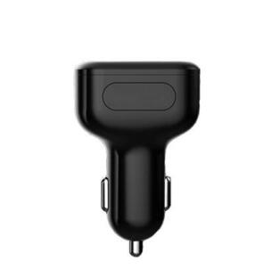

# GOTOP - A5

The GOTOP A5 is a compact car charger GPS tracker that combines vehicle charging functionality with location tracking in a single plug and play device. Designed to be inserted into a vehicle power outlet, the A5 provides continuous tracking without relying on removable batteries. It supports multiple locating methods including GPS, LBS, WiFi, AGPS, and BDS, and offers real time tracking via GPRS, SMS, web platform, or mobile app. Additional features such as history route playback, voice monitoring, vibration alarm, and support for a TF card make the A5 a versatile choice for everyday vehicle monitoring.

As a Plaspy compatible device, the A5 can feed location and status information into Plaspy for centralized visibility and fleet oversight. Its compact size and integrated charger form factor make it easy to deploy across vehicles where discreet, always powered tracking is preferred. Plaspy users can incorporate the A5 into their monitoring workflows to view live positions, review past routes, and configure alerts that support operational decisions and security procedures.

## Key Highlights

- Dual function as a car charger and GPS tracker for continuous power and discreet placement
- Multi mode locating using GPS, LBS, WiFi, AGPS, and BDS for flexible positioning in varied environments
- Real time tracking available through GPRS, SMS, web platform, or mobile app
- History route playback and local storage support via TF card up to 32 GB
- Built in voice monitoring, voice recorder, and vibration alarm for additional situational awareness
- Compact dimensions and light weight for easy concealment and minimal cabin impact
- Remote power off and restart features to assist with device management

## How It Works with Plaspy

When connected to Plaspy, the GOTOP A5 streams its location and status updates to the Plaspy platform where data is consolidated alongside other devices. Plaspy translates the incoming tracking information into map views, timelines, and alerts, enabling fleet managers and operators to act on location intelligence without managing multiple vendor systems.

- Real time location display on Plaspy maps for live vehicle monitoring and dispatching
- Route history playback to review past movements and generate operational reports
- Configurable alerts in Plaspy based on movement, vibration, low power, or custom conditions supported by the device
- Remote commands and device management opportunities where supported, such as restart or power control features reported by the A5
- Data export and reporting to support operational analysis and compliance workflows

## Typical Use Cases

- Vehicle security and anti theft monitoring where discreet always powered tracking is required
- Fleet visibility for small to medium vehicle fleets that need route history and real time position
- Rental or shared vehicle monitoring to review usage and past routes
- Delivery and logistics operations that benefit from combined charging and tracking convenience
- Personal vehicle tracking for guardianship or asset oversight

## Why Choose This Tracker with Plaspy

The GOTOP A5 is a practical option for organizations and individuals who want a low profile, always powered tracker that doubles as a car charger. Its combination of multiple locating methods and local storage options makes it adaptable to urban and highway environments, while voice monitoring and vibration alarm features provide added context for security and operational scenarios. For Plaspy users, the A5 offers a straightforward way to add vehicles into a unified tracking platform without complex installation requirements.

Because the A5 is compatible with Plaspy, it can be integrated into broader monitoring and reporting workflows to improve visibility and control across mobile assets. If you need a compact, multifunction vehicle tracker that works with Plaspy for centralized fleet oversight, the GOTOP A5 is a useful candidate to evaluate.

Learn more about Plaspy on the main website https://www.plaspy.com. Product specifications, availability, and manufacturer details can change over time, so please verify current specifications and official documentation on the manufacturer site https://www.gotop.cc/.
