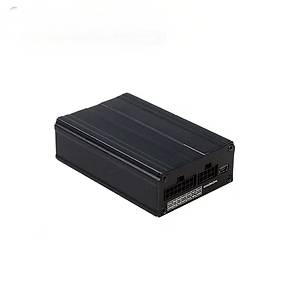

# GOTOP - A5G

The GOTOP A5G is a professional vehicle GPS tracker designed for fleet management, public transport, taxi operations, rental car oversight and private vehicle anti theft. The device combines multi generation cellular connectivity with GNSS positioning and optional camera capability to deliver continuous location and event data for vehicles and mobile assets. Its I O and alarm features make it suitable for applications that require evidence capture, driver identification and a range of operational sensors.

As a Plaspy compatible device, the A5G streams location and telemetry into the Plaspy platform for centralized monitoring, alerting and reporting. Plaspy can ingest the A5G’s location updates, alarms and input events to provide fleet visibility, geofence alerts and historical trip analysis, making the A5G a practical choice for organizations that want to pair on vehicle hardware with cloud based fleet software.

## Key Highlights

- Multi generation cellular connectivity plus GNSS positioning for resilient location updates across wide areas.
- Dual positioning using GNSS and GSM base station fallback to improve continuity of tracking.
- Built in RS232 and 1 wire interfaces to support camera evidence and driver identification workflows.
- Comprehensive alarm handling including SOS, jamming detection, antenna and power cut, door and engine status, geofence and harsh driving alerts.
- Internal battery backup to support recovery and immobilization scenarios during power loss.
- Optional fuel and temperature monitoring and support for camera and voice related features to add operational context.
- OTA firmware upgrade support for centralized device maintenance and reduced depot visits.

## How It Works with Plaspy

When integrated with Plaspy, the A5G delivers a steady stream of position and event data to a centralized fleet dashboard so managers can monitor vehicles in real time and review historical activity. Plaspy maps device inputs and alarms to platform workflows so teams can act on incidents, analyze trends and automate reporting.

- Real time location and telemetry updates including GNSS coordinates and fallback GSM based positioning for continuity.
- Vehicle status inputs such as ignition and door events feed Plaspy alerts, trip segmentation and runtime reporting.
- Remote stop and immobilization related events are available as part of operational control where the operator has configured them.
- Optional fuel level and temperature sensor readings reported via the A5G provide Plaspy with cargo and engine related telemetry.
- Camera and RFID or i Button events can be associated with GPS records in Plaspy for compliance and incident review.

## Typical Use Cases

- Fleet management and telematics for routing, utilization monitoring and maintenance planning.
- Anti theft and recovery workflows using alarms, jamming detection and battery backup to aid vehicle retrieval.
- Taxi, public transport and rental operations requiring driver ID, incident evidence and passenger safety features.
- Fuel and refrigerated cargo monitoring where analog sensor inputs provide ongoing status to operations teams.
- Insurance and risk management programs that rely on event logs, harsh driving detection and captured evidence.

## Why Choose This Tracker with Plaspy

The A5G pairs practical vehicle focused hardware with the Plaspy platform to deliver an operationally useful solution for fleets and transport operators. Its combination of resilient cellular connectivity, dual positioning and rich I O options allows organizations to collect the location and context they need while keeping device management centralized through OTA updates.

For teams using Plaspy, the A5G’s alarms, sensor inputs and optional camera support translate into meaningful alerts, incident context and historical records that aid compliance and decision making. If your operation requires vehicle centric tracking with flexible sensor and evidence options, the A5G is a candidate worth evaluating with Plaspy for end to end fleet visibility.

To learn more about Plaspy visit https://www.plaspy.com. Product specifications, availability and manufacturer details can change over time, so please verify current technical data and options on the official GOTOP site https://www.gotop.cc/.
