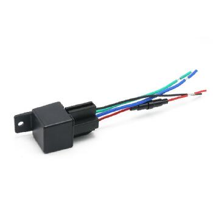

# GOTOP - C720

The GOTOP C720 is a compact relay style car GPS tracker designed for discreet vehicle installation where covert monitoring and anti theft control are required. Its ultra small form factor and hardwired design make it suitable for hidden placement in cars, motorcycles and other vehicles while providing continuous position updates and alarm reporting via GSM/GPRS and GPS positioning. The device includes AGPS support, multi channel GNSS reception and internal antennas to improve fix reliability in typical vehicle environments.

As a Plaspy compatible device, the C720 can feed location and status telemetry into Plaspy dashboards and mobile notifications for fleet oversight, alarm handling and historical route review. Its support for GPRS and SMS reporting means Plaspy can ingest real time packets and event driven alerts such as geo fencing, vibration alarms and main power cut warnings, helping operations teams monitor assets and respond to theft or operational incidents.

## Key Highlights

- Plaspy compatible reporting through GPRS and SMS for integration with cloud dashboards and mobile apps.
- Ultra compact relay style design suited to covert installations in cars and motorcycles.
- Remote immobilizer and power cut support to assist anti theft interventions.
- AGPS with a multi channel U BLOX GNSS module for improved position accuracy in vehicle settings.
- Multiple alarm types including geo fence, vibration or movement, low battery and main power cut alerts for proactive monitoring.
- Low power sleeping mode to reduce draw when the vehicle is off while maintaining monitoring capability.

## How It Works with Plaspy

When connected and configured, the C720 sends periodic position packets and event driven alarms over GPRS or SMS to cloud platforms. Plaspy receives that telemetry, maps vehicle locations, triggers notifications and stores historical data for reporting and playback. Integration is focused on visibility, alerts and operational oversight rather than platform specific device management steps.

- Real time location updates and continuous monitoring displayed on Plaspy maps for live fleet visibility.
- Geo fencing events sent to Plaspy trigger entry and exit notifications for perimeter based alerts.
- Movement, vibration and low battery alarms deliver immediate telemetry to Plaspy for anti theft response and maintenance planning.
- Main power cut detection and remote immobilizer status provide actionable alerts for security workflows when coordinated through Plaspy.
- Historical route playback and reporting available in Plaspy for audits, route verification and operational analysis.

## Typical Use Cases

- Covert vehicle tracking and recovery for stolen vehicle location and retrieval.
- Fleet operations that require hidden or discreet tracker installations for high value or sensitive assets.
- Anti theft workflows combining movement alarms and remote immobilizer actions to assist recovery.
- Route replay and compliance checks using historical position data for audits and operational review.
- Continuous visibility for mixed fleets of cars and motorcycles requiring compact tracking hardware.

## Why Choose This Tracker with Plaspy

The C720 is a practical choice for organizations that need a low profile, hardwired tracker that can be integrated into a centralized telematics platform. Its compact size and relay style form factor make it easier to hide on vehicles, while AGPS and a multi channel GNSS module support reliable position reporting in common fleet environments. Paired with Plaspy, the device's alarms and geo fence events become part of a broader monitoring and response workflow.

For operations focused on theft prevention, discreet monitoring or small vehicle fleets, the C720 offers a balance of compact hardware and Plaspy compatibility that supports real time oversight, notifications and historical reporting. If you need centralized tracking and alerting across a mixed vehicle fleet, combining the GOTOP C720 with Plaspy can help consolidate telemetry and incident response into a single operational view.

To learn more about Plaspy and how compatible trackers fit into its platform visit https://www.plaspy.com. Product specifications, availability and manufacturer details can change over time, so verify current technical information and compatibility on the official manufacturer website https://www.gotop.cc/.
