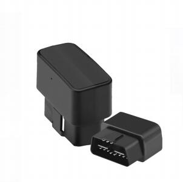

# GOTOP - C750

The C750 OBD GPS Tracker is a compact, plug-and-play GPS tracker designed for fast deployment in cars and light commercial vehicles. Plaspy compatible out of the box, the C750 uses GSM/GPRS communications and U‑Blox GNSS positioning to deliver real-time tracking, configurable alerts, and reliable event reporting without hardwiring—simply plug it into the vehicle OBD-II port and start monitoring location and telemetry on Plaspy immediately.

The C750 is optimized for fleet management and anti-theft use: built-in GPS and GSM antennas, A‑GPS assistance, and a small built-in rechargeable battery that maintains reporting during a power cut. Fleet managers and vehicle owners get instant Google Maps links, overspeed and geo-fence alerts, movement and vibration alarms, and GPRS/SMS reporting—making the C750 an effective, low-friction solution for real-time tracking and vehicle telemetry when integrated with Plaspy.

## Key Highlights

- Plaspy compatible plug-and-play OBD-II tracker for fast installation and immediate real-time tracking.
- GSM/GPRS connectivity \(850/900/1800/1900 MHz\) and U‑Blox GPS for dependable positioning and telemetry.
- Configurable alerts for overspeed, geo-fence breaches, movement, vibration, and power cuts to support anti-theft and driver behavior control.
- Built-in rechargeable 110 mAh \(3.7V\) backup battery ensures reports continue during external power loss.
- Instant location checks via Google Maps URLs delivered by SMS or over GPRS for quick visual verification.
- Compact, lightweight form factor \(45 x 40 x 25 mm, 28 g\) made for unobtrusive in-vehicle use.
- Suitable for both consumer vehicles and commercial fleet management deployments requiring low-effort installation.

## How It Works with Plaspy

Integrating the C750 with Plaspy provides a streamlined flow of location and event data into Plaspy’s dashboard and alerts engine. The device reports position via GPRS for continuous tracking or via SMS on demand. Plaspy ingests location and telemetry, applies geofencing and speed rules, raises notifications, and displays precise positions on maps for real-time operational visibility.

- Real-time location and telemetry updates delivered to Plaspy over GPRS or on-demand via SMS.
- Overspeed and geo-fence breach alerts forwarded to Plaspy for immediate notification and reporting.
- Movement and vibration alarms reported to Plaspy to support anti-theft workflows and tamper detection.
- Power-cut detection—C750’s backup battery allows the device to report power loss events and continue sending critical alerts to Plaspy.
- Vehicle OBD-II connection enables capture of any vehicle-exposed telemetry \(for example ignition status or fuel-related data\) when that information is available via the vehicle’s OBD-II interface; Plaspy can correlate this OBD-derived data with GPS and event logs.

## Technical Overview

| Connectivity | GSM/GPRS \(2G\) |
| --- | --- |
| Bands | 850 / 900 / 1800 / 1900 MHz |
| Power & Battery | Input/charging +9 to +45 VDC; built-in rechargeable 110 mAh \(3.7V\) backup battery for power-cut reporting |
| Interfaces | Plug-and-play OBD-II interface for vehicle connection; SMS/GPRS reporting for data and alerts |
| GNSS | U‑Blox GPS chip; sensitivity down to -159 dBm; typical 2D RMS positioning accuracy ≈ 5 m; A-GPS supported |
| Bluetooth | No Bluetooth/BLE sensors specified |
| Remote Management | Configurable alerts and reporting via SMS and GPRS; Google Maps URL support for quick location checks |
| Form Factor | Compact OBD-II plug; dimensions 45 x 40 x 25 mm; weight 28 g |
| Environmental | Operating temperature -20°C to 70°C; humidity 5%–95% non-condensing |

## Use Cases

- Fleet management: real-time tracking of cars and light-duty vehicles, driver behavior monitoring \(overspeed alerts\), route verification, and basic telemetry reporting via Plaspy.
- Vehicle anti-theft and recovery: movement, vibration, and power-cut alerts help detect unauthorized movement and trigger immediate Plaspy notifications.
- Rental and shared vehicles: easy plug-and-play installation for temporary installations and fast turnover between drivers without hardwiring.
- Compliance and safety: enforce speed policies with overspeed alerts and geo-fence zones to improve safety and reduce risk across your fleet.
- Operational visibility for small fleets: low-cost deployment for managers who need real-time tracking and event-driven alerts integrated into Plaspy dashboards.

## Why Choose This Tracker with Plaspy

The C750 offers a practical balance of reliability, simplicity, and cost-effectiveness when paired with Plaspy. Its OBD-II plug-and-play design removes installation complexity, accelerating rollouts across a fleet and reducing downtime. With robust GSM/GPRS communications, A‑GPS positioning, and a backup battery to report power loss events, the C750 supports core fleet management and anti-theft workflows that Plaspy optimizes into alerts, reports, and map-based monitoring. For teams seeking real-time tracking, improved driver compliance, and straightforward telemetry collection without custom wiring, the C750 plus Plaspy provides a fast, scalable solution.

