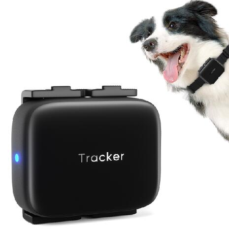

# GOTOP - D02

The GOTOP D02 is a waterproof pet tracker built to help owners keep track of their animals in wet or active environments. With an IP68 swimming level rating, the device is designed to continue functioning through rain and accidental submersion. The D02 combines multiple positioning methods including GPS, WiFi, LBS, and BeiDou, and offers 4G LTE and GSM connectivity along with GPRS tracking and SMS location links for flexible location reporting.

As a Plaspy compatible device, the D02 can deliver location and status data into Plaspy for centralized monitoring and fleet style oversight of pet devices. Plaspy can use the D02 feed to display real time location, record historical tracks, and trigger alerts for events such as geofence entry or low battery, making the tracker a practical option for owners or organizations that want consolidated visibility and basic operational controls through the Plaspy platform.

## Key Highlights

- IP68 waterproof rating suitable for swimming and heavy rain exposure
- Multi mode positioning with GPS WiFi LBS and BeiDou for broad coverage
- 4G LTE real time tracking plus GPRS and SMS location link options
- Sound and light pet seeking with large speaker and remote voice call function
- Remote monitoring and recording capabilities to check surroundings
- Geo fence and low battery alerts to aid proactive oversight
- Pedometer and feeding reminder features for activity and care tracking

## How It Works with Plaspy

When paired with Plaspy, the GOTOP D02 sends location and status updates that Plaspy displays and stores to support monitoring and reporting workflows. Plaspy acts as the central view for devices like the D02 so owners and managers can track movement, review events, and receive alerts from a single platform.

- Live location displayed on Plaspy maps for real time visibility
- Historical track logs and simple reports to review past movements
- Geofence alerts and low battery notifications surfaced in Plaspy
- Device status and activity indicators such as pedometer or feeding reminders logged for operational oversight
- Event timestamps and SMS location links can be captured or referenced for situational follow up

## Typical Use Cases

- Tracking active pets that frequently swim or play outdoors
- Locating lost or runaway pets with real time position updates
- Monitoring pet activity and feeding schedules for caretakers or boarding facilities
- Providing owners and small animal services with centralized visibility of multiple pet devices
- Using audio and light seeking functions to assist in close range recovery

## Why Choose This Tracker with Plaspy

The GOTOP D02 pairs durable hardware design with the connectivity needed for reliable location reporting, which makes it a suitable choice for pet owners who want continuous visibility even in wet conditions. Its mix of positioning technologies and alert features align well with Plaspy use cases that require straightforward tracking, geofencing, and status monitoring across multiple devices.

For organizations and individual users who prefer to manage devices centrally, combining the D02 with Plaspy gives a streamlined way to see live locations, review historical activity, and receive simple operational alerts. If your primary requirement is a rugged pet tracker that feeds location and event data into a consolidated platform, the GOTOP D02 is a model to consider.

To learn more about how Plaspy can work with this tracker visit https://www.plaspy.com. Product specifications, availability, and manufacturer details can change over time; please verify current specifications and support information on the official manufacturer website https://www.gotop.cc/ before making procurement decisions.
