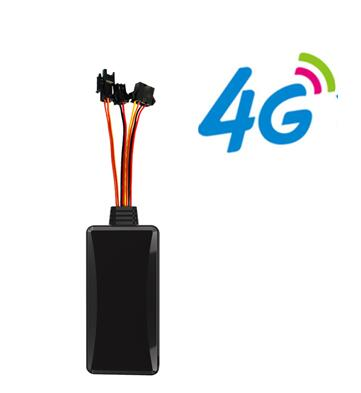

# GOTOP - D06-4G

The D06-4G is a compact, Plaspy compatible GPS tracker designed for reliable real time tracking and fleet management of cars, motorcycles, e-bikes and other vehicles. Built for discreet installation, the unit combines a high sensitivity GNSS receiver with 4G connectivity and 2G fallback to keep location and status information flowing even in variable coverage conditions. Its IP65 rated housing and onboard memory for offline storage make it suitable for exposed vehicle installations and longer term anti theft deployments.

As a device that reports position fixes and event telemetry, the D06-4G maps naturally into Plaspy workflows. It delivers geofence alerts, power cut detection, SOS signals, vibration alarms and remote relay control for immobilization or power cut actions, all of which can be ingested by Plaspy to provide live monitoring, history playback and actionable notifications for fleet managers and security teams.

## Key Highlights

- Plaspy compatible tracker offering real time tracking over 4G with 2G fallback for broad coverage.
- Multi mode positioning support to improve location availability in both urban and rural areas.
- Comprehensive alarm set including geofence alerts, power cut detection, vibration alarms and SOS reporting.
- Remote relay control for immobilization or power cut actions to assist theft recovery and vehicle control.
- Internal memory buffers location data during network outages to preserve route history.
- Compact, discreet IP65 rated enclosure designed for exposed vehicle installations.

## How It Works with Plaspy

When connected to Plaspy the D06-4G sends its position fixes and event reports to the platform where they become part of live maps, alerting and historical records. Plaspy ingests the incoming telemetry and presents it to operators and authorized users for oversight and action.

- Live location visualization on Plaspy maps for continuous fleet oversight.
- Event and alarm forwarding so geofence breaches, power cut alerts, SOS and vibration alarms appear as platform notifications.
- Route history playback using stored and transmitted position logs for audits and incident review.
- Remote relay actions initiated from Plaspy to perform immobilization or other configured control functions.
- Offline data recovery when the device rejoins the network, ensuring a complete activity record is captured.
- Centralized reporting and exportable logs to support operational analysis and compliance needs.

## Typical Use Cases

- Fleet management for cars, motorcycles and light commercial vehicles with centralized monitoring and route oversight.
- Vehicle anti theft and recovery operations using geofence alerts, vibration detection and remote relay control.
- Long term tracking and history logging where offline storage preserves route data during outages.
- Emergency response workflows that leverage SOS alerts to notify operators and contacts.
- Discreet or covert vehicle monitoring in authorized security and investigative contexts.

## Why Choose This Tracker with Plaspy

The D06-4G is a practical choice for organizations that need a durable, discreet tracker that feeds reliable location and event data into Plaspy. Its multi mode positioning and fallback connectivity reduce coverage gaps, while onboard memory and auxiliary alarms protect data continuity and support rapid incident response. For teams that require live telemetry, clear alerting and the ability to act remotely, pairing this device with Plaspy provides a straightforward path to operational visibility.

If you want to learn more about how the D06-4G works with Plaspy and whether it fits your deployment, visit https://www.plaspy.com for platform information and sales guidance. Product specifications, availability and manufacturer details can change over time, so verify current technical data on the official manufacturer site https://www.gotop.cc/.
