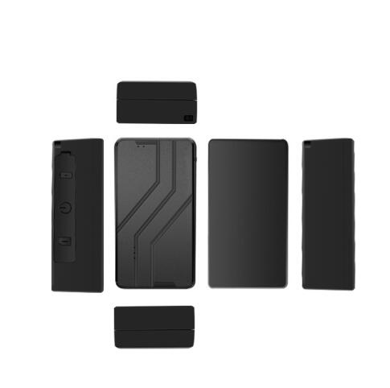

# GOTOP - D09

The GOTOP D09 is a portable magnetic asset GPS tracker designed for secure monitoring and rapid recovery of vehicles, trailers and industrial equipment. Built for rugged conditions, the D09 combines multi mode positioning with a strong magnet and a waterproof enclosure to enable covert mounting and continuous location visibility. It is offered in three rechargeable battery capacities and supports broad cellular coverage to match deployment autonomy and reach.

As a Plaspy compatible device, the D09 can stream location and event data into the Plaspy platform for live tracking, alerting and historical playback. That compatibility makes the D09 a practical option for fleet managers and asset owners who want to add covert, battery powered asset monitoring to their Plaspy account with support for real time alerts and SMS location fallbacks.

## Key Highlights

- Portable magnetic form factor for covert attachment to metal assets and equipment.
- Multi mode positioning for improved location accuracy in a variety of environments.
- Three rechargeable battery options to balance deployment duration and size needs.
- Rugged waterproof enclosure to withstand harsh outdoor conditions.
- Configurable alarm suite including movement, drop off, geo fence and low battery alerts.
- Real time tracking and history replay for recovery and operational review.
- SMS location messages as a quick fallback for location lookups without platform access.

## How It Works with Plaspy

When connected to Plaspy, the D09 delivers location and event messages into the Plaspy account so you can monitor assets on live maps, configure alerts, and review historical traces. Plaspy ingests the device messages and presents them alongside other fleet telemetry for unified operational oversight.

- Live location updates appear on Plaspy maps and fleet dashboards for continuous visibility.
- Movement, drop off and geo fence events generate alerts that can be routed through Plaspy notification rules.
- History playback and trace export allow post event analysis and recovery investigation.
- Low battery and other device alarms are synchronized with Plaspy for timely maintenance and response.
- SMS location links provide rapid location access when platform login is not immediately available.

## Typical Use Cases

- Covert trailer and service vehicle monitoring to detect unauthorized movement and enable recovery.
- Container and equipment tracking where waterproofing and durable mounting are required.
- Short term deployments or temporary asset surveillance using selectable battery capacities.
- Operational visibility for parking reminders, shake alerts and site compliance checks.
- Asset protection for remote sites and high value portable equipment.

## Why Choose This Tracker with Plaspy

The D09 is a practical choice for organizations that need a rugged, flexible asset tracker that integrates into an established fleet management workflow. Its magnetic mounting and waterproof design simplify deployment on a wide range of metal assets, while multiple battery options let teams tailor autonomy to the use case. Paired with Plaspy, the D09 contributes to centralized monitoring, alerting and history review without complex wiring or permanent installation.

Because the D09 is compatible with Plaspy, it can be incorporated into existing Plaspy fleets to provide anti theft alerts, location history and runtime management. This combination is well suited to operations that require covert placement, reliable notification flows and a single point of operational visibility across mixed asset types.

Learn more about how Plaspy can work with compatible trackers like the GOTOP D09 on the Plaspy website https://www.plaspy.com. Product specifications, availability and manufacturer details can change over time, so please verify current technical information and configuration options with the manufacturer at https://www.gotop.cc/.
