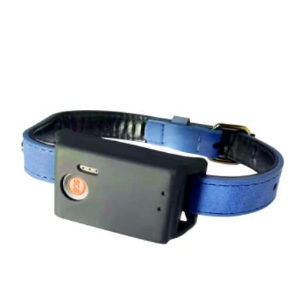

# GOTOP - D50

The GOTOP D50 is a compact 4G pet GPS tracker designed for attachment to collars and everyday outdoor use. It combines GNSS positioning with cellular uplink and fallback location methods to provide continuous location monitoring, route history playback, motion detection, and SOS alerts in a small waterproof housing. The form factor and IPX7 protection make it suitable for dogs, cats and other small pets where comfort and durability are important.

As a Plaspy compatible device out of the box, the D50 reports standard position and event data so Plaspy users can view live location, historical routes and geofence alerts in a single dashboard. Its assisted satellite fixes and power management features make it a practical option for owners and light commercial pet monitoring, delivering location visibility and event notification that Plaspy can display and manage for operational oversight.

## Key Highlights

- Designed for pets with a compact 47 × 27 × 18 mm waterproof housing that fits comfortably on collars.
- Real time tracking, route history and geofence alerts available directly in Plaspy when paired.
- Hybrid positioning with assisted GNSS for faster fixes and cellular based fallback to maintain best effort location indoors or in urban areas.
- Motion detection and SOS notifications provide event reporting for unusual activity and emergency situations.
- Power saving modes and a rechargeable battery balance standby life with frequent updates for active tracking needs.
- Practical telemetry reporting over common cellular data channels for straightforward integration with tracking platforms.

## How It Works with Plaspy

The D50 sends standard position and event messages that Plaspy ingests and displays on maps, timelines and alert lists. Plaspy processes the device timestamps and location data to provide live visibility and historical playback, while event flags such as SOS or motion become actionable alerts that can trigger notifications and reporting.

- Live location updates appear on Plaspy maps for real time monitoring of individual pets.
- Route history playback in Plaspy lets users review past movements with timestamps.
- Geofence configuration in Plaspy triggers entry and exit alerts for safe zone monitoring.
- SOS and motion alerts are forwarded to Plaspy to surface urgent events and incident records.
- Fallback location data helps Plaspy maintain continuity of tracking when GNSS accuracy is reduced.
- Device status and battery condition shown in Plaspy support operational oversight and maintenance planning.

## Typical Use Cases

- Real time pet location monitoring during walks, travel, or outdoor activity.
- Geofence alerts to notify owners when a pet leaves a yard, park, or neighborhood.
- SOS alerts for immediate notification if a pet is in distress and needs attention.
- Indoor or urban locating where fallback positioning provides a best effort location estimate.
- Activity checks using motion alerts to detect unexpected movement or extended inactivity.

## Why Choose This Tracker with Plaspy

The GOTOP D50 pairs a purpose built pet tracker design with straightforward platform integration, making it a sensible choice for owners and small scale monitoring services that use Plaspy. Its compact, waterproof housing and event reporting features deliver the core functionality Plaspy needs to provide reliable location visibility, geofence management and incident alerts without unnecessary complexity.

If you want a pet focused GPS tracker that works with a full featured tracking platform, the D50 offers a balanced combination of accuracy, durability and event reporting that integrates into Plaspy for consistent monitoring and historical review. Learn more about Plaspy on the main website https://www.plaspy.com. Product specifications, availability and manufacturer details can change over time, so please verify current technical and regulatory information on the official manufacturer site https://www.gotop.cc/.
