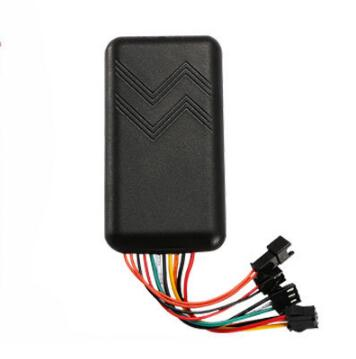

# GOTOP - G01

The GOTOP G01 is a compact car GPS tracker designed for reliable vehicle tracking, fleet management and anti theft protection. It combines GNSS positioning and proven vehicle inputs and outputs to deliver location and event data suitable for commercial fleets, rental vehicles, taxis and private cars. The device is built to operate across a broad vehicle voltage range and includes features that help detect tampering and enable remote interventions.

As a Plaspy compatible device, the G01 streams location fixes and vehicle status into Plaspy so operators can monitor vehicles in real time, receive alarms and review historical reports. Its vehicle focused controls such as ACC detection, SOS alarm and remote cut off make the G01 a practical option where Plaspy dashboards, alerts and workflows are used to manage operations and respond to incidents.

## Key Highlights

- Plaspy compatible GPS tracker for live tracking and fleet management integration.
- Dual GNSS positioning with GPS and BDS for precise location reporting.
- Wide vehicle voltage support suitable for cars, taxis and many commercial vehicles.
- Vehicle control and anti theft features including ACC detection, SOS alarm and remote power or fuel cut off.
- Backup battery to maintain reporting during power loss and assist tamper detection.
- External mic and remote audio monitoring capability to assist security events.
- Compact ABS housing for discreet fitting across mixed vehicle types.

## How It Works with Plaspy

When paired with Plaspy, the G01 supplies location updates and vehicle event data that feed Plaspy maps, alerts and reports so fleet managers can maintain operational oversight and respond to incidents from the Plaspy interface.

- Real time location updates and mapping for live vehicle visibility.
- Ignition and trip state detection to build trip logs, start stop events and support basic driver monitoring.
- Remote power or fuel cut off controlled through Plaspy workflows to support anti theft responses.
- SOS, power off and movement alarms routed into Plaspy alerts to trigger notifications and incident handling.
- Remote audio monitoring and external mic input used as part of verification or recovery workflows.
- Historical playback and reports for route analysis, utilization and incident investigation.

## Typical Use Cases

- Fleet management for live tracking, trip logging and operational efficiency improvements.
- Rental and shared mobility where tamper detection, backup battery and immobilizer actions help protect assets.
- Taxis and ride services needing reliable position reporting and trip state awareness.
- Commercial vehicle deployments that benefit from wide voltage tolerance and rugged operation.
- Safety and emergency response workflows using SOS alarms and remote monitoring for faster incident handling.

## Why Choose This Tracker with Plaspy

The G01 is a practical choice for organizations that need a straightforward, vehicle focused tracker compatible with Plaspy. It provides the essential inputs and outputs fleet operators rely on to tie vehicle events into Plaspy alerts and reports without unnecessary complexity. The combination of dual GNSS positioning, vehicle controls and a backup battery supports consistent tracking and helps detect tampering or power loss.

For mixed fleets or deployments that require additional capabilities, Plaspy can be used alongside other compatible devices to create a complete telematics solution. To learn more about Plaspy and how the G01 can be used within the platform visit https://www.plaspy.com. Product specifications, features and availability can change over time, so verify current technical details and official documentation on the manufacturer site https://www.gotop.cc/.
