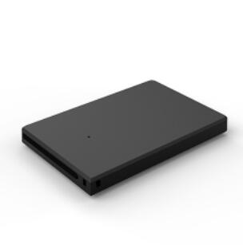

# GOTOP - G033

The Name Card GPS Tracker G033 is an ultra-compact, Plaspy compatible GPS tracker designed to blend discreetly into daily life while delivering reliable position reports and alerts. Styled to look and feel like a business card, the G033 supports quad-band GSM and GPS satellite positioning to provide real-time tracking via GPRS, SMS and integration with web platform or mobile app — making it a practical choice for personal positioning, student protection, lone worker safety and small-scale personnel management through the Plaspy ecosystem.

Built for low visibility without sacrificing functionality, the G033 offers multi-mode positioning \(GPS/LBS/WiFi/AGPS\), voice monitoring and route history playback. Its compact form factor, long standby battery life and multiple reporting methods make it ideal where a credit-card sized GPS tracker is required. When added to Plaspy, the G033 delivers live location, telemetry-style alerts and historical playback that help teams monitor people and sensitive assets with confidence.

## Key Highlights

- Plaspy compatible: real-time tracking via GPRS \(TCP/IP\) plus SMS links for fast location access on Google Maps.
- Ultra-compact, credit-card form factor \(71.8 × 45.6 × 8.5 mm, 30 g\) for discreet personal and asset tracking.
- Multi-mode positioning: GPS, LBS, WiFi and AGPS for improved coverage in varied environments.
- Voice monitoring and recorder with TF card support \(up to 32 GB\) for on-device logs and evidence capture.
- Long standby: 1050 mAh rechargeable battery with up to 30 days standby for extended unattended use.
- Multiple reporting options: SMS with Google Maps links, GPRS real-time updates for Plaspy, and mobile app/web platform compatibility.
- Safety and alert features: vibration alarm, low battery alert, remote power-off/restart and find-device function.

## How It Works with Plaspy

Integrating the G033 into Plaspy is straightforward: the device pushes position packets over GPRS \(TCP/IP\) to a tracking server or can provide immediate SMS replies with a Google Maps link. Once connected to Plaspy, you can view live location on the map, access historical route playback, and receive alerts reported by the unit. Plaspy’s platform consolidates telemetry-style data and event notifications so monitoring teams can act quickly.

- Real-time location and telemetry updates over GPRS \(Class 12, TCP/IP\) for live tracking on Plaspy.
- SMS reply with direct Google Maps link for instant location access when GPRS is unavailable.
- History route playback and off-line logs stored on TF card \(supports up to 32 GB\) for audit and review.
- Voice monitoring and recorded audio files stored locally on TF card for context-aware events.
- Alerting: vibration alarm, low battery notification, and remote commands \(power-off/restart, find device\) surfaced through Plaspy.

## Technical Overview

| Connectivity | Quad-band GSM \(850/900/1800/1900 MHz\); GPRS Class 12 \(TCP/IP\) |
| --- | --- |
| Bands | GSM 850 / 900 / 1800 / 1900 MHz |
| Power & Battery | Rechargeable 1050 mAh battery; standby up to 30 days |
| Interfaces | Nano SIM card slot; TF card slot \(supports up to 32 GB\) for logs and voice recordings |
| GNSS | GPS positioning; cold start ~60 s, warm start ~29 s, hot start ~5 s \(open sky\); positioning accuracy 10–15 m \(open sky\) |
| Positioning Modes | GPS / LBS / WiFi / AGPS \(WiFi accuracy 5–50 m; LBS accuracy 100–1000 m\) |
| Bluetooth | Not specified / no Bluetooth sensors listed |
| Remote Management | SMS commands, web platform and mobile app reporting; GPRS real-time tracking |
| Form Factor | Card-style ultra-compact tracker; color: Black; size 71.8 x 45.6 x 8.5 mm; weight 30 g |
| Chipset | MT2503 + 3333 + 5931 |
| Operating Conditions | -18°C to +45°C; humidity 5%–95% RH |

## Use Cases

- Student protection and family safety — discreet carry for children or elderly relatives with live location and SOS/alerts.
- Lone worker safety — remote monitoring, vibration alarm and voice monitoring for personnel working alone in the field.
- Personnel management — location check-ins, route playback and recorded voice notes for on-the-road teams.
- Asset tracking where discretion matters — credit-card sized form factor for equipment, briefcases or sensitive materials.
- Short-term rental or shared equipment oversight — history logs and remote find-device function simplify recovery and accountability.

## Why Choose This Tracker with Plaspy

The G033 delivers a focused set of features that complement Plaspy’s platform: compact design for unobtrusive placement, reliable multi-mode positioning for consistent coverage, and flexible reporting via GPRS and SMS for live tracking and quick location sharing. Its long standby battery and local TF card storage for history and voice recordings provide operators with both immediate situational awareness and forensic detail for later review.

For organizations and individuals using Plaspy, the G033 is a practical choice when discreet personal tracking, student protection, lone worker safety or personnel oversight are priorities. While Plaspy also supports trackers that include telemetry and vehicle-specific inputs such as ignition/immobilizer, fuel monitoring or Bluetooth sensors, the G033 is optimized for personal and asset-focused use cases where form factor, voice capability and multi-mode location accuracy matter most.

