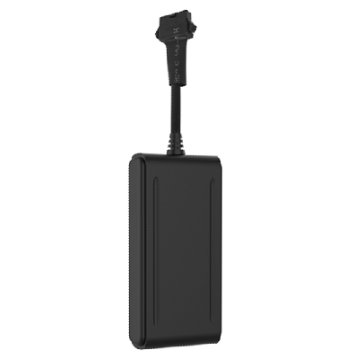

# GOTOP - G06B

The GOTOP G06B is a compact 4G car GPS tracker designed for vehicle locating and monitoring. It combines a waterproof IP67 enclosure with real time 4G connectivity and core vehicle safety features such as ACC detection, an SOS button, and a remote engine cut off option. The device also supports a set of alarms including geo fencing, low battery, vibration, movement, and main power cut alerts to help maintain awareness of vehicle status.

As a Plaspy compatible device, the G06B can feed location and event data into the Plaspy platform for centralized visibility and operational oversight. Plaspy customers can use the G06B to track vehicles on maps, receive alarm notifications, and include device events in reporting and fleet dashboards, making the tracker a practical option for both individual vehicle owners and fleet operators.

## Key Highlights

- 4G LTE connectivity for near real time tracking and monitoring
- IP67 rated enclosure for reliable use in varied weather conditions
- ACC detection and SOS button for basic vehicle status and emergency alerts
- Remote engine cut off capability to support vehicle security workflows
- Multiple alarm types including geo fencing, low battery, vibration, movement, and main power cut
- Compact form factor suitable for discreet vehicle installation and fleet deployments

## How It Works with Plaspy

The G06B streams location and event data that Plaspy ingests to present live positions, historical tracks, and alarm events on a unified dashboard. Using Plaspy with a compatible GOTOP G06B lets organizations consolidate vehicle telemetry alongside other devices and use platform features to manage operations and respond to incidents.

- Live location display and historical route playback for operational review
- Alarm forwarding so geo fence breaches, SOS presses, and other alerts trigger notifications in Plaspy
- Status monitoring including ignition events to help track vehicle use and duty cycles
- Centralized reporting to summarize events, trips, and alarm history across a fleet
- Fleet overview and map tools for dispatching and oversight from a single interface

## Typical Use Cases

- Personal car security and emergency alerting with SOS support
- Fleet vehicle tracking for small and medium sized delivery or service fleets
- Rental car monitoring and basic usage oversight including ignition status
- Vehicle anti theft workflows using remote cut off and alarm notifications
- On demand location visibility for roadside assistance and fleet coordination

## Why Choose This Tracker with Plaspy

The GOTOP G06B pairs a weather resistant compact design with standard vehicle focused features that address common tracking needs. For organizations and individuals seeking reliable location updates, alarm notifications, and basic vehicle status reporting, the G06B presents a straightforward option that integrates with Plaspy for centralized monitoring and management.

Plaspy adds value by presenting G06B data alongside other fleet information, enabling reporting, alert workflows, and map based oversight without requiring specialized tooling. For users evaluating solutions, the combination of G06B hardware and Plaspy software offers a pragmatic balance of device capability and platform functionality for vehicle tracking.

Learn more about Plaspy on the main website https://www.plaspy.com. Product specifications, availability, and manufacturer details for the GOTOP G06B can change over time; please verify current specifications on the official manufacturer site https://www.gotop.cc/ before purchase or deployment.
