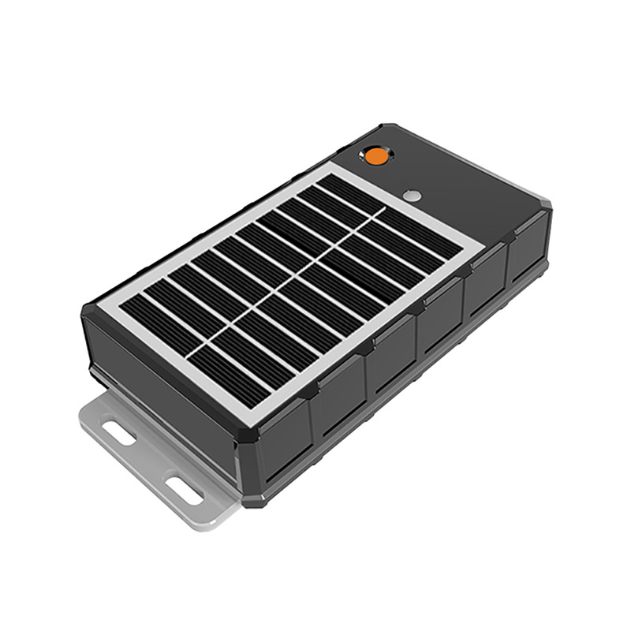

# GOTOP - G07E

The GOTOP G07E is a 4G solar magnet GPS tracker designed for low maintenance, long term asset monitoring. It combines an integrated solar panel with a removable high capacity rechargeable battery to sustain extended outdoor operation. Rugged waterproofing and a strong integrated magnet make the G07E suitable for attaching to containers, trailers, heavy equipment and other metal chassis where continuous autonomous tracking is needed.

As a Plaspy compatible device, the G07E feeds hybrid positioning and event data into Plaspy for live maps, alerts and fleet level reporting. The tracker supports real time GPRS tracking and SMS location links, uses Wi‑Fi assisted positioning to improve indoor accuracy, and logs positions to microSD for continuity in areas with intermittent coverage. These capabilities make it a practical choice for organizations that want persistent tracking and straightforward integration with Plaspy workflows.

## Key Highlights

- Plaspy compatible 4G solar magnet GPS tracker for long term outdoor asset tracking
- Integrated solar panel and removable high capacity rechargeable battery for reduced maintenance
- Rugged IP67 IPX7 waterproof enclosure and powerful integrated magnet for secure mounting
- Hybrid positioning with A GPS assist, Wi Fi assisted positioning and GSM reporting for better coverage
- Real time location reporting via GPRS and SMS location links with Google Maps support
- Offline logging to microSD up to 32 GB plus motion drop trigger and SOS alarm features

## How It Works with Plaspy

When connected to Plaspy the G07E supplies continuous location and event feeds that Plaspy uses for mapping, alerting and operational reporting. Plaspy ingests live position updates, SMS based location links and Wi‑Fi assisted positions, while also using onboard logging to reconstruct history when coverage is interrupted.

- Live tracking on Plaspy maps using the device's GPRS position updates and SMS location links when available
- Immediate forwarding of motion alerts, drop trigger events and SOS alarms to Plaspy for notifications and escalation
- Geofence monitoring and historical route playback using onboard logging and microSD exports to preserve continuity
- Battery and power status reporting to support maintenance planning and low battery alerts
- Precision recovery support with Radar Find Me and Wi‑Fi assisted positioning for close range or indoor location

## Typical Use Cases

- Container and trailer tracking requiring long battery life and minimal maintenance
- Heavy equipment and plant machinery attachment where rugged mounting and waterproofing are essential
- Fleet monitoring of non powered assets using historical logs and live location for utilization analysis
- Anti theft and recovery workflows using motion alerts, SOS and precision find functions
- Remote telemetry and service scheduling where offline logging preserves event history

## Why Choose This Tracker with Plaspy

The G07E is tailored for persistent outdoor deployments where reduced maintenance and reliable attachment matter. Its solar charging, removable battery and robust magnet mount reduce onsite servicing while the waterproof design helps ensure continuous operation in exposed conditions. Feeding hybrid positioning and event telemetry into Plaspy, the device supports real time monitoring, geofence automation and historical analysis that fleet managers and asset owners rely on.

If you want to learn more about how Plaspy can use GOTOP devices like the G07E to improve visibility and operational workflows, visit the Plaspy main website https://www.plaspy.com. Product specifications, availability and manufacturer details can change over time, so please verify current specifications on the official manufacturer website https://www.gotop.cc/ before finalizing procurement or deployment.
