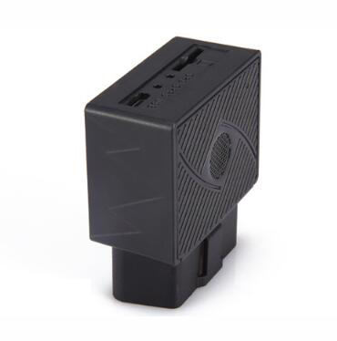

# GOTOP - G08

The GOTOP G08 is a compact plug and play OBD GPS tracker designed for rental cars, taxis, fleet vehicles and light trucks. It combines GPS and BeiDou positioning with LBS fallback and a set of vehicle alarms to support real time tracking, anti theft monitoring and straightforward fleet management rollouts. Its form factor and design focus on quick deployment and unobtrusive cabin presence.

As a Plaspy compatible device the G08 is optimized for rapid integration into vehicle fleets managed on Plaspy. The unit draws vehicle power from the OBD port and includes a backup battery for short interruptions, letting Plaspy ingest location fixes, status messages and alarm events right away. This makes the G08 a practical option when teams need visibility, alerting and basic telematics without lengthy installation windows.

## Key Highlights

- Plaspy compatible OBD II plug in installation for fast, non invasive deployment across fleets
- GPS plus BeiDou positioning with LBS fallback and typical accuracy around 5 meters
- Continuous vehicle power range plus a 180 mAh backup battery to cover short power interruptions
- Vehicle alarms for overspeed, movement, vibration and power off to support anti theft workflows
- Compact ABS housing and internal antennas for a low visual footprint inside the cabin
- Low standby and working current to minimize impact on vehicle electrical systems

## How It Works with Plaspy

When installed the G08 streams location fixes, status updates and alarm events over the cellular link into Plaspy, where the data is available in real time for monitoring and reporting. Plaspy ingests the G08 telemetry to provide live location, historical replay and configurable alert rules so operations teams can act on events as they occur.

- Real time location and telemetry updates from GPS and BeiDou with LBS fallback shown on Plaspy maps
- Overspeed, movement and vibration alarms surface as instant events inside Plaspy dashboards and notification rules
- Power off and DC input detection appear in Plaspy to support anti theft alerts and maintenance workflows
- Optional audio input and other supported signals can be captured when permitted and made available for compliance or event review
- Plaspy can aggregate G08 data with other compatible modules to enrich fleet analytics and operational reporting

## Typical Use Cases

- Rapid fleet rollouts for rental car companies that need quick, non invasive tracking deployment
- Taxi and rideshare operations monitoring routes, incidents and driver events
- Light truck and delivery vehicle protection using vibration and power loss alarms for last mile assets
- Rental car security and unauthorized use detection with immediate alerts to operations teams
- Operational visibility for small to medium fleets seeking real time location and basic telematics

## Why Choose This Tracker with Plaspy

The GOTOP G08 is a practical choice for organizations that need easy installation, reliable positioning and essential alarm types without adding wiring complexity. Its plug and play OBD form factor, combined positioning sources and backup power offer a balance of continuous visibility and simple maintenance that aligns well with Plaspy workflows.

Paired with Plaspy, the G08 feeds centralized dashboards and alert rules so fleet managers can monitor location, respond to incidents and run basic reporting without long setup times. For teams that later require expanded telemetry, Plaspy can combine G08 position and alarm data with other compatible devices to create a more comprehensive telematics solution.

To learn more about Plaspy and how the platform handles fleet devices like the G08 visit https://www.plaspy.com. Product specifications, availability and manufacturer details can change over time, so please verify current specifications and documentation with the manufacturer at https://www.gotop.cc/.
