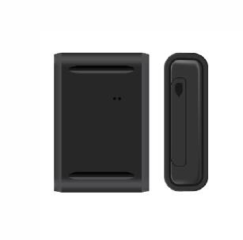

# GOTOP - G20

The GOTOP G20 is a compact smart GPS tracker designed for both person and asset tracking. It combines satellite and network positioning to provide location updates with an advertised accuracy of around 5 meters. The device is offered with multiple battery capacity options and includes practical features such as remote audio monitoring, vibration and move alarms, overspeed and low voltage alerts, and a strong magnet for easy attachment to assets.

As a Plaspy compatible device, the G20 can feed position and status information into the Plaspy platform for centralized visibility and management. Its combination of precise positioning, audible monitoring features, configurable alarms, and rugged IP65 housing makes it a fit for organizations that need lightweight, discreet tracking hardware integrated into a fleet or asset oversight workflow on Plaspy.

## Key Highlights

- Precise positioning with approximately 5 meter accuracy for reliable location reporting
- Multi mode positioning using satellite and network assisted methods for broader coverage
- Several battery capacity options to support longer tracking intervals and flexible deployments
- Built in remote audio monitoring and recording features for additional situational awareness
- Motion, vibration, overspeed, and low voltage alarms to support proactive alerts
- Small, lightweight design with a powerful magnet for discreet attachment and portability
- IP65 rated housing for dust and water resistance in everyday operational environments

## How It Works with Plaspy

The G20 can be used with Plaspy to bring hardware location and alert data into a single fleet management interface, enabling operators to monitor assets and people alongside other devices. When connected, Plaspy can display location history, trigger notifications based on device alarms, and aggregate data for reporting and operational oversight.

- Live location display and location history visualization inside the Plaspy platform
- Alerting based on device events such as movement, overspeed, vibration, or low battery
- Grouping and device management to organize trackers by vehicle, asset type, or user
- Reporting and exportable activity logs to support operational reviews and audits
- Geographical oversight and filterable views to focus on specific regions or assets

## Typical Use Cases

- Rental vehicle tracking and recovery monitoring
- Monitoring of credit vehicles and fleet assets for compliance and utilization
- Passenger vehicles and taxi fleet tracking for dispatch and safety oversight
- Tracking of trucks and commercial assets during transit or storage
- Personal asset protection and discreet monitoring of high value items

## Why Choose This Tracker with Plaspy

The GOTOP G20 pairs a concise set of tracking and alerting features with a form factor suitable for both people and asset deployments. For organizations using Plaspy, the G20 offers a balance of accuracy, battery options, and event reporting that supports many common fleet and asset management needs without adding unnecessary complexity.

Because the G20 is compact, weather resistant, and provides several alarm and monitoring capabilities, it can be a practical choice where discreet attachment and reliable basic telemetry are important. Plaspy can consolidate G20 device data alongside other fleet assets to provide unified monitoring, notifications, and reporting across an organization.

To learn more about how Plaspy works with compatible trackers and to evaluate options for your fleet, visit https://www.plaspy.com. Product specifications, availability, and manufacturer details can change over time, so verify current technical information on the official GOTOP website https://www.gotop.cc/.
