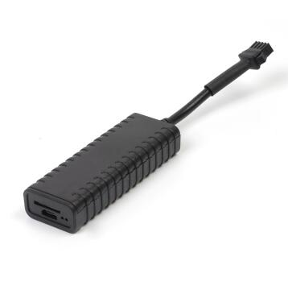

# GOTOP - G23D

The GOTOP G23D is a compact and reliable CDMA GPS tracker built for vehicle tracking across a range of platforms including cars, e-bikes, and motorcycles. It combines GPS, BDS, and LBS positioning to provide location data with an advertised accuracy of around 5 meters. Designed with a wide voltage input range and a small footprint, the G23D targets applications where discreet, robust tracking is needed across varied vehicle types.

As a Plaspy compatible device, the G23D can feed location and event data into Plaspy for centralized monitoring and fleet oversight. Its practical feature set — including ACC detection, remote power or fuel off events, power off alarm, DC detection, and overspeed alarm — maps naturally to the visibility, alerting, and reporting capabilities Plaspy provides for fleet managers and vehicle owners.

## Key Highlights

- Compact and lightweight form factor suitable for concealed installation and diverse vehicle types
- Multi constellation positioning with GPS BDS LBS and reported position accuracy near 5 meters
- Wide voltage input range of 9V to 95V for compatibility with many vehicle electrical systems
- Built in functionality for ACC detection, power off alarm, DC detection, and overspeed alarm
- Remote power or fuel off capability to support vehicle control workflows or security measures
- Internal aerial and Micro SIM slot with CDMA support for mobile connectivity in supported regions
- Durable ABS housing and small dimensions that suit fleet and personal vehicle deployment

## How It Works with Plaspy

When connected to Plaspy, the GOTOP G23D provides position updates and event notifications that Plaspy uses to present live tracking, historical playback, and operational alerts. Plaspy ingests the device's location and status reports to create actionable views for fleet operators and vehicle owners.

- Real time location tracking and map display for individual vehicles and fleets
- Alerting and notifications for overspeed events, power off, and ACC state changes
- Historical route playback and reporting for trip analysis and fleet oversight
- Centralized device status and event logs for operational troubleshooting
- Integration of remote power or fuel off events into Plaspy workflows for security and control

## Typical Use Cases

- Fleet management for small to mid size commercial vehicle fleets such as taxis and delivery vans
- Monitoring rental or shared vehicles to track usage and location
- Security and anti theft tracking for motorcycles and e bikes
- Vehicle oversight for passenger transport and taxi operations
- Tracking trucks and larger vehicles where wide voltage compatibility is required

## Why Choose This Tracker with Plaspy

The GOTOP G23D is a practical choice when you need a small, versatile tracker that supports a broad range of vehicle electrical systems and provides essential monitoring features. Its multi constellation positioning and compact design make it a fit for mixed fleets where concealment, consistent location data, and simple event signaling are important.

Paired with Plaspy, the G23D can deliver the location visibility and event-driven alerts fleet managers expect without adding unnecessary complexity. Because the device supports the key tracking and alarm functions commonly used in fleet operations, it can be managed and monitored alongside other devices in Plaspy to provide unified reporting and operational oversight.

To learn more about how Plaspy can use device data from the GOTOP G23D, visit https://www.plaspy.com. Product specifications, availability, and manufacturer details can change over time, so please verify current technical information on the official GOTOP website at https://www.gotop.cc/.
