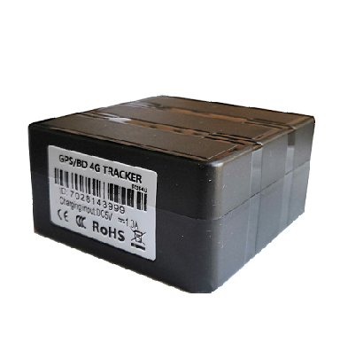

# GOTOP - G25

The GOTOP G25 is a 4G asset tracker designed for reliable and efficient tracking of various assets. With its big battery capacity, this GPS tracker is perfect for long-term tracking and protection. Whether you need to track private cars, rental vehicles, equipment, fleet vehicles, trucks, containers, bicycles, e-bikes, motorcycles, or even trunk/carton boxes, the G25 is a versatile solution for asset tracking and management. It can also be used for other security protection tracking purposes.

The G25 supports 4G LTE/3G/2G GSM networks, ensuring reliable and fast connectivity. It features a built-in GPS and 4G antenna, allowing for wireless installation and easy setup. The tracker is equipped with a high waterproof rating of PIX-6 and a super magnet, ensuring durability and secure attachment. With support for both web platform and mobile app tracking, you can conveniently monitor and manage your assets from anywhere. The G25 also offers a range of useful features such as drop-off alarm, movement alarm, lower battery alarm, and sleeping power-save mode. With its Google map link locating and real-time tracking capabilities, you can easily keep an eye on your assets at all times.

Key Features:

- Built-in GPS and 4G Antenna, wireless installation
- High waterproof PIX-6, super magnet
- Support web platform and mobile APP tracking
- Big battery capacity \(5000/10000 mAh\) for long standby time
- Support SMS parameter settings and query functions
- Google map link locating and real-time tracking
- Drop off alarm, movement alarm, lower battery alarm
- Sleeping power-save mode

With its advanced features and reliable performance, the GOTOP G25 is an excellent choice for asset tracking and protection. Whether you need to track vehicles, equipment, or other valuable assets, this 4G GPS tracker provides the functionality and convenience you need.

