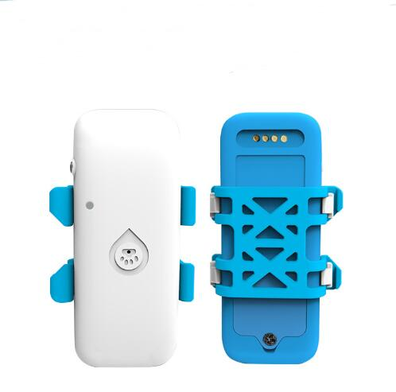

# GOTOP - G32

The Mini GPS Tracker G32 is a compact, purpose-built GPS tracker for cats and dogs that is Plaspy compatible out of the box. Designed to give pet owners reliable, always-on location visibility, the G32 provides real-time tracking via SMS or 4G, fast AGPS positioning and a direct Google Maps link for instant location viewing. Built on MTK GPS technology and optimized for small form factor use, the G32 combines precise positioning with configurable alarms and remote monitoring to help keep pets safe.

The G32 pairs easily with Plaspy to centralize location data, alarms and history in a single dashboard. Its rechargeable 800mAh lithium battery supports extended operation between charges, and features such as GPRS blind-area data re-upload and voice monitoring make the device a practical option for pet owners who need dependable telemetry and timely alerts. Whether you want geofence notifications, movement alarms or low-battery warnings, the G32 delivers the core tracking functions you need while integrating cleanly with Plaspy’s real-time tracking and alerting tools.

## Key Highlights

- Plaspy compatible mini GPS tracker optimized for pets — easy integration with centralized tracking dashboards.
- Real-time tracking over SMS and 4G — fast location updates when you need them most.
- AGPS support with MTK GPS chipset — quicker position fixes and reliable outdoor accuracy.
- Rechargeable 800mAh lithium battery — compact power solution for extended operation in a small package.
- GPRS blind-area data re-upload — ensures location history is preserved after temporary signal loss.
- Voice monitoring — remote listen-in capability for situational awareness \(device-level feature\).
- Configurable alarms including geofence, movement, low-battery and speeding alerts — customizable notifications for different scenarios.

## How It Works with Plaspy

The G32 transmits location and event data via SMS or 4G to the configured server or phone number. When used with Plaspy, those updates become visible on Plaspy’s real-time tracking map and are stored for historical playback. AGPS reduces the time-to-first-fix, so Plaspy receives accurate locations sooner after device wake-up. GPRS blind-area data re-upload means that if the device temporarily loses connectivity while roaming or in weak-signal areas, buffered points are re-sent and Plaspy can reconstruct the full track without gaps.

- Real-time location and telemetry updates delivered to Plaspy via SMS/4G.
- Geofence and movement alarms forwarded to Plaspy for immediate notification.
- Low-battery and speeding alerts appear as events in Plaspy so you can act quickly.
- GPRS blind-area data re-upload preserves continuity of tracks when connectivity is intermittent.
- Google Maps link in device messages enables quick map access from alerts and history entries.

## Technical Overview

| Model | Mini GPS Tracker G32 |
| --- | --- |
| Connectivity | SMS and 4G \(device supports real-time updates via cellular\) |
| GNSS | MTK GPS chipset with AGPS support |
| Battery | 800mAh rechargeable lithium battery |
| Positioning Output | Google Maps link; SMS/4G location messages |
| Data Continuity | GPRS blind-area data re-upload to avoid tracking gaps |
| Audio | Voice monitoring \(remote listen feature\) |
| Alarms & Alerts | Geo-fence alarm, movement alarm, low-battery alarm, speeding alert |
| Form Factor | Mini tracker designed for use on cats and dogs |

## Use Cases

- Pet recovery and anti-theft: real-time tracking and geofence alerts help locate a missing or stolen pet quickly.
- Active outdoor monitoring: monitor hikes, off-leash walks or roaming behaviour with movement alerts and location history.
- Multi-animal care: small breeders and kennels can track multiple animals and receive low-battery/movement notifications for each unit.
- Pet-sitter sharing: provide a trusted sitter with a Google Maps link or Plaspy access for transparent location sharing during caregiving.
- Discreet small-asset tracking: use the compact G32 on backpacks or small equipment where a mini GPS tracker is preferable.

## Why Choose This Tracker with Plaspy

Pairing the G32 with Plaspy gives pet owners both a purpose-built device and a scalable platform for centralized monitoring. The G32’s MTK GPS engine and AGPS support deliver fast, reliable fixes while the 800mAh rechargeable battery and GPRS blind-area re-upload provide practical day-to-day resilience. Plaspy complements the device by aggregating live location data, handling alarm routing and offering historical playback — so you get actionable telemetry without juggling multiple tools.

Beyond basic pet tracking, Plaspy’s platform approach lets you unify the G32 alongside other trackers or telemetry devices in the same account. That means fleet management dashboards, advanced telemetry, or integrations with devices that include fuel monitoring, ignition/immobilizer telemetry or Bluetooth sensors can live side-by-side with your pet trackers — all under one roof. For pet owners who want a compact GPS tracker that’s easy to manage, offers voice monitoring and configurable alerts, the G32 plus Plaspy delivers dependable real-time tracking and sensible operational controls.

