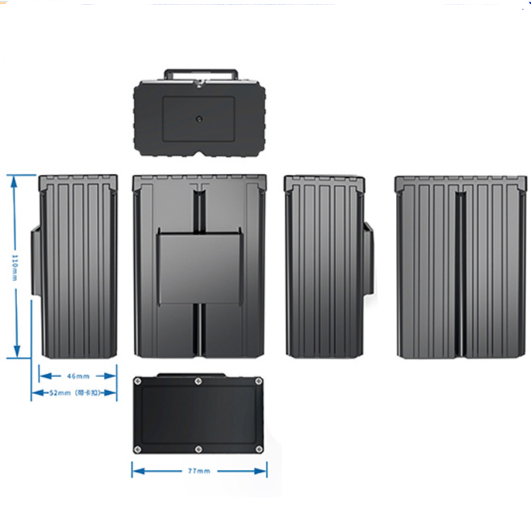

# GOTOP - G35

The GOTOP G35 is a collar mounted animal GPS tracker built for long duration monitoring of pets, livestock and animals in the field. It combines multi mode positioning and a rugged IP67 waterproof housing with an unusually large 20000 mAh rechargeable battery to provide dependable real time location and status information for recovery, research, and routine animal management. The unit includes features designed to aid in finding animals in low light such as an audible locate tone, LED flash and voice monitoring, and it supports offline waypoint logging for deployments where continuous connectivity is not guaranteed.

As a Plaspy compatible device, the G35 can feed its location updates, alarm events and status messages into Plaspy so you can manage animal tracking from the same platform you use for other assets. Because the tracker can send data by SMS or LTE, its telemetry and alerts are straightforward to ingest into Plaspy for centralized monitoring, geofence based notifications and historical route review. This makes the G35 a practical hardware option for teams that want specialized animal tracking capabilities combined with Plaspy style operational oversight.

## Key Highlights

- Plaspy compatible for integration into centralized tracking dashboards and alerting workflows
- Multi mode positioning to improve location reliability across varied environments
- Large 20000 mAh rechargeable battery for extended deployments and long standby life
- Rugged IP67 rated collar form factor suitable for pets, livestock and outdoor use
- On device recovery features including audible locate tone, LED flash and voice monitoring
- Offline waypoint logging to capture historical routes during periods without connectivity

## How It Works with Plaspy

The G35 transmits position and status data via SMS or LTE data so its outbound telemetry can be collected and displayed within Plaspy for real time oversight and reporting. Integration typically uses the device's standard messages and the manufacturer's backend or export tools to bring location updates, alarm events and stored logs into Plaspy for unified monitoring.

- Real time location and telemetry delivered to Plaspy using the device's SMS or LTE data messages
- Geofence, movement and low battery alarms forwarded into Plaspy for instant notification and rule based actions
- Stored waypoint memory supports historical route playback when logs are uploaded and synchronized into Plaspy
- On demand voice monitoring, audible locate tone and LED flash can be tracked alongside positional updates
- Battery and motion status feed into Plaspy reporting to maintain continuous situational awareness for deployments

## Typical Use Cases

- Pet recovery and lost animal searches using real time tracking and locate features
- Livestock monitoring for farms and ranches with geofence and movement alerts
- Wildlife research and field studies that require long battery life and offline logging
- Animal transport oversight where centralized route monitoring and alert escalation are needed
- Long term deployments in remote or harsh environments where rugged hardware and standby life matter

## Why Choose This Tracker with Plaspy

The G35 pairs specialized animal tracking hardware with the operational benefits of a centralized platform. Its long endurance, robust enclosure and multi mode positioning make it suitable for extended outdoor use, while on device locate tools and offline logging help maintain useful telemetry when connectivity is intermittent. Feeding G35 data into Plaspy gives teams a single view for monitoring, alerting and historical review alongside other tracked assets.

If you want Plaspy compatible animal tracking hardware for recovery, research, or routine animal management, the G35 is a practical option to consider. Learn more about Plaspy on the main website https://www.plaspy.com and verify current specifications and availability on the manufacturer website https://www.gotop.cc/ as product details and features can change over time.
