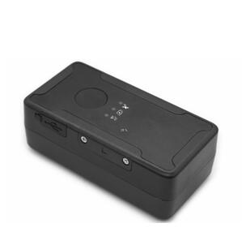

# GOTOP - G909-4G

The G909-4G Mini Asset GPS Tracker is a Plaspy compatible GPS tracker designed for compact asset and vehicle monitoring where reliable 4G connectivity and precise satellite positioning matter. Built around 4G LTE FDD communications and GPS/BDS satellite reception, the G909-4G delivers real-time tracking and event reporting suitable for fleet management, logistics, and anti-theft protection when integrated with the Plaspy platform.

The unit combines an industrial-grade, full built-in antenna and an anti-jamming ceramic GPS/BDS module with AGPS fast positioning and synchronous timing to reduce time-to-first-fix. With intelligent power-saving modes, offline storage, and remote management capabilities, the G909-4G is optimized for continuous telemetry and dependable location updates in vehicle and asset applications when used with Plaspy.

## Key Highlights

- Plaspy compatible GPS tracker: native support for TCP/IP domain or IP server connections for platform integration.
- 4G LTE FDD communication with high-sensitivity GSM/GPRS fallback for broad network coverage and real-time tracking.
- Dual GNSS reception \(GPS/BDS\) with anti-jamming ceramic module and AGPS for faster, more reliable position fixes.
- Built-in large-capacity offline storage that caches data during signal loss and uploads automatically after reconnecting.
- Intelligent power-saving and three adaptable operating modes to extend deployment life in varied installations.
- Integrated 3-axis acceleration sensor for attitude detection, vibration alarms, and advanced event judgments.
- Fleet and security features: overspeed alarm, geo-fencing \(electronic fences\), remote voice monitoring, and real-time alert uploads.

## How It Works with Plaspy

Connecting the G909-4G to Plaspy enables robust real-time tracking, event notifications, and remote device management. The tracker uses TCP/IP to push location and telemetry to Plaspy’s server \(domain or IP\), while its onboard features generate alarms and data that Plaspy can ingest, visualize, and act on. Remote configuration and online firmware upgrades further streamline large-scale deployments.

- Real-time location and telemetry updates: GNSS positions and sensor-derived events are transmitted over 4G to Plaspy for live maps and history.
- Event and alarm reporting: vibration alarm, overspeed alarm, and geo-fence enter/exit alerts upload instantly to Plaspy and can trigger notifications.
- Offline data handling: built-in storage preserves data during connectivity loss and auto-uploads when the device reconnects to the network.
- Remote device control and maintenance: remote configuration and online firmware upgrades \(FOTA-capable via platform\) simplify fleet management.
- Platform synergy: Plaspy can combine G909-4G position and acceleration data with other telemetry streams \(fuel monitoring, ignition, immobilizer status, Bluetooth sensors\) where those data sources are available in your fleet or asset system.

## Technical Overview

| Connectivity | 4G LTE FDD; high-sensitivity GSM/GPRS communication module supporting TCP/IP \(domain or IP server\) |
| --- | --- |
| Bands | Not specified in provided description |
| Power & Battery | Intelligent power-saving working modes; three adaptable operating modes. Battery or input power details not specified |
| Interfaces | Remote voice monitoring, alarm outputs via platform alerts; onboard 3-axis acceleration sensor. Specific I/O pins \(ignition input, digital I/O, immobilizer\) not specified |
| GNSS | GPS and BDS satellite positioning with anti-jamming ceramic GNSS module, AGPS fast positioning, and synchronous timing for reduced time-to-first-fix |
| Bluetooth | Not specified |
| Remote Management | Remote configuration and online firmware upgrades; TCP/IP server connectivity for platform management |
| Form Factor | Mini asset/vehicle tracker — compact design for installation on vehicles and small assets |

## Use Cases

- Fleet management: live vehicle location, trip history, and overspeed alerts to improve routing and driver compliance.
- Anti-theft and recovery: vibration alarms, geofence alerts, and real-time tracking for stolen asset recovery and security monitoring.
- Logistics and asset tracking: compact form factor for tracking pallets, trailers, containers, and high-value portable equipment.
- Remote monitoring and telemetry: combine GNSS and acceleration events in Plaspy dashboards for status awareness and incident investigation.
- Mixed-sensor deployments: use G909-4G location and motion data alongside other telemetry \(fuel sensors, ignition state, immobilizer controls, Bluetooth sensors\) within Plaspy to build a complete vehicle profile.

## Why Choose This Tracker with Plaspy

When integrated with Plaspy, the G909-4G delivers a compact, dependable GPS tracker that emphasizes real-time tracking, resilience in weak-signal conditions, and manageable fleet-scale operations. Its 4G LTE FDD communications and GNSS redundancy \(GPS/BDS\) provide consistent positioning, while built-in storage prevents data loss during network blind spots. The device’s acceleration sensor and event alarms bring actionable telemetry into Plaspy for efficient incident detection and response.

Operational benefits include simplified remote management through online configuration and firmware upgrades, lower power draw via adaptable working modes, and reduced time-to-first-fix with AGPS and synchronous timing. Together with Plaspy’s support for telemetry, fuel monitoring, ignition/immobilizer signals, and Bluetooth sensor integration where available, the G909-4G becomes a versatile component of a scalable fleet management and anti-theft solution.

