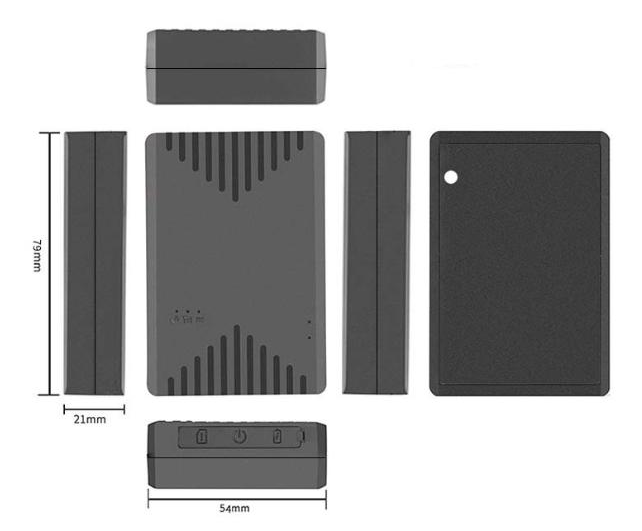

# GOTOP - GV6

The GV6 4G Asset Tracker is a compact, long-life GPS tracker designed for persistent asset monitoring and protection. Plaspy compatible out of the box, the GV6 combines multi-mode positioning \(BD/GPS/LBS/WiFi\) with flexible 4G/2G cellular connectivity and multiple battery configurations to deliver dependable real-time tracking for containers, trailers, equipment and other high-value assets.

Built for fleet management and anti-theft operations, the GV6 is optimized for telemetry-heavy deployments where long battery endurance and accurate location reporting matter. Its small form factor, IP65 water resistance and remote management features make it an adaptable GPS tracker for both covert and overt installations when integrated with the Plaspy platform.

## Key Highlights

- Plaspy compatible GPS tracker for real-time tracking and fleet management visibility.
- Multi-mode positioning \(Beidou/GPS/LBS/WiFi\) improves location accuracy in varied environments.
- Long-life battery options—multiple configurations \(1500 mAh, 2500 mAh, 5000 mAh\) to match operational endurance needs.
- 4G LTE and 2G GSM connectivity with broad LTE band support for global deployments.
- Anti-fake base station detection to reduce spoofing/tampering risk and enhance anti-theft protection.
- Remote parameter configuration over SMS or cloud platform; scheduled power control and remote power on/off for energy optimization.
- Removal/drop alarm plus remote voice monitoring and voice recording for situational awareness and security audits.

## How It Works with Plaspy

When paired with Plaspy, the GV6 streams location and device status via cellular networks into Plaspy’s cloud. Plaspy ingests the GV6’s multi-mode positioning and alarm events to provide real-time tracking, historical routes, and event-driven alerts. Remote commands issued from Plaspy \(or via SMS where supported\) can adjust reporting intervals, manage power schedules, and enable or disable device features to conserve battery life or respond to security incidents.

- Real-time location and telemetry updates delivered to Plaspy for map visualization and reporting.
- Removal/drop alarm and anti-fake base station alerts forwarded to the platform for immediate notification.
- Remote power on/off and scheduled power control enable long deployments and optimize battery use.
- Remote voice monitoring and voice recording available for incident verification and added security context.
- Fuel monitoring, ignition and immobilizer controls, or Bluetooth sensors can be incorporated at the Plaspy integration layer using external sensors or vehicle interfaces where required — enabling telemetry expansion beyond in-device capabilities.

## Technical Overview

| Connectivity | 4G LTE and 2G GSM \(variants\) |
| --- | --- |
| Bands | Broad LTE band compatibility depending on variant: B1/B3/B5/B7/B8/B20 and alternatively B1/B2/B3/B4/B5/B7/B8/B28/B66; GSM 850/900/1800/1900 MHz |
| Power & Battery | Multiple battery configurations: 31×54×20 mm \(1500 mAh, ~41 g\), 79×54×14 mm \(2500 mAh, ~96 g\), and 79×54×21 mm \(5000 mAh, ~132 g\). Designed for long-life asset deployments. |
| Ingress Protection | IP65 water resistance for outdoor and exposed installations |
| Positioning | Multi-mode positioning: BD \(Beidou\), GPS, LBS and WiFi |
| Security & Alarms | Anti-fake base station detection, removal/drop alarm, remote voice monitoring and voice recording |
| Remote Management | Remote parameter configuration via SMS and cloud platform; scheduled power control and remote power on/off |
| Form Factor | Compact enclosure suitable for containers, equipment, bicycles, trailers and general asset tracking |

## Use Cases

- Fleet and vehicle tracking — integrate GV6 with Plaspy for route visibility, asset utilization reporting and anti-theft alerts.
- Container and trailer monitoring — long battery life and IP65 rating make GV6 suitable for logistics and intermodal tracking.
- Equipment and machinery locating — persistent telemetry helps reduce downtime and speeds recovery of lost or stolen assets.
- Bicycle, e-bike and motorcycle security — small form factor and removal alarm provide discreet anti-theft protection.
- General asset protection — track trunks, carton boxes and high-value goods with scheduled reporting to conserve battery.

## Why Choose This Tracker with Plaspy

The GV6 offers a balanced combination of long battery life, multi-mode positioning and flexible cellular support that makes it an excellent GPS tracker for Plaspy-compatible deployments. For organizations that require dependable real-time tracking, telemetry and anti-theft measures, the GV6 reduces operational complexity through remote configuration and cloud-ready connectivity. Plaspy leverages GV6 data to provide actionable fleet management dashboards, alerting workflows and historical reports — and can integrate external inputs for fuel monitoring, ignition/immobilizer controls and Bluetooth sensors where additional telemetry is required.

Choose GV6 with Plaspy when you need a trustworthy, compact asset tracker that supports long-duration monitoring, reliable location reporting and practical security features like anti-fake base station detection and removal alarms. The combination delivers improved asset visibility, faster incident response and cost-efficient telemetry for logistics and security teams.

