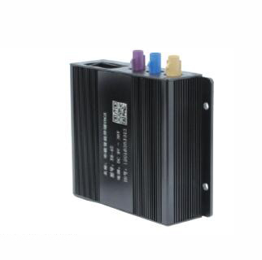

# GOTOP - GX6

The GOTOP GX6 (GX6-4G) is a 4G vehicle tracking device designed for fleet management and vehicle tracking solutions. It provides multi-constellation positioning (GPS BD LBS) with a stated positioning accuracy around 5 meters and includes a broad set of vehicle-oriented features such as ACC detection, remote power or fuel cut, DC detection, power off alarm, overspeed alarm, remote audio monitoring, remote door control, and Geo-fence. The unit is built with industrial considerations in mind, offering a wide input voltage range and a metal housing with a compact footprint and a backup battery for continued tracking during power loss.

As a Plaspy compatible device, the GX6 can feed location and event data into Plaspy for centralized fleet visibility and operational oversight. Its combination of positioning accuracy, multi-mode location options, and vehicle control features make it a practical choice for organizations that want to use Plaspy for live tracking, alerts, and basic remote vehicle management. The device specifications and functional set align with common fleet monitoring workflows that Plaspy supports.

## Key Highlights

- 4G vehicle tracker model designed for fleet and vehicle tracking applications
- Multi constellation positioning using GPS BD LBS with approximately 5 meter accuracy
- Wide functional set including ACC detection, remote power fuel off, overspeed alarm, Geo-fence, and remote audio or door control
- Industrial grade build with wide voltage input range and metal housing for durability
- Backup battery for tracking continuity during vehicle power interruptions
- Compact dimensions and modest weight for flexible installation in a variety of vehicle types

## How It Works with Plaspy

When integrated into Plaspy, the GOTOP GX6 supplies location updates and vehicle events to Plaspy’s monitoring and reporting platform, enabling fleet managers to view and act on real time and historical information. Plaspy can consolidate GX6 telemetry alongside other devices to provide a unified operational picture.

- Real time vehicle location on Plaspy maps for live tracking and route oversight
- Event and alarm forwarding such as overspeed, power off alerts, and Geo-fence breaches
- Centralized status monitoring including ACC and power state for fleet supervision
- Use of remote control events in Plaspy workflows for operational responses and incident handling
- Historical trip and location reporting to support analysis and compliance reviews

## Typical Use Cases

- Rental vehicle fleets that require reliable location tracking and remote power control options
- Passenger vehicles and taxi operations needing live monitoring, Geo-fence, and overspeed alerts
- Truck and logistics fleets where durability and broad voltage support are important
- Vehicle security and recovery workflows using alarms, remote audio, and location history
- Mixed fleets that benefit from a compact industrial tracker with backup battery for continuity

## Why Choose This Tracker with Plaspy

The GOTOP GX6 pairs a comprehensive set of vehicle management features with positioning accuracy and industrial design, making it a balanced option for organizations that need both tracking precision and practical vehicle controls. Its backup battery and wide voltage tolerance contribute to reliable data delivery, while the range of alarms and remote functions map directly to common fleet monitoring use cases within Plaspy.

Choosing the GX6 for use with Plaspy can simplify fleet visibility by combining a feature rich tracker with Plaspy’s centralized monitoring, alerting, and reporting capabilities. This combination supports day to day fleet operations as well as incident response and historical analysis without requiring specialized customization.

To learn more about Plaspy and how it integrates with compatible devices like the GOTOP GX6, please visit https://www.plaspy.com. Product specifications, availability, and manufacturer details can change over time, so verify current technical details and the latest documentation with the manufacturer at https://www.gotop.cc/
