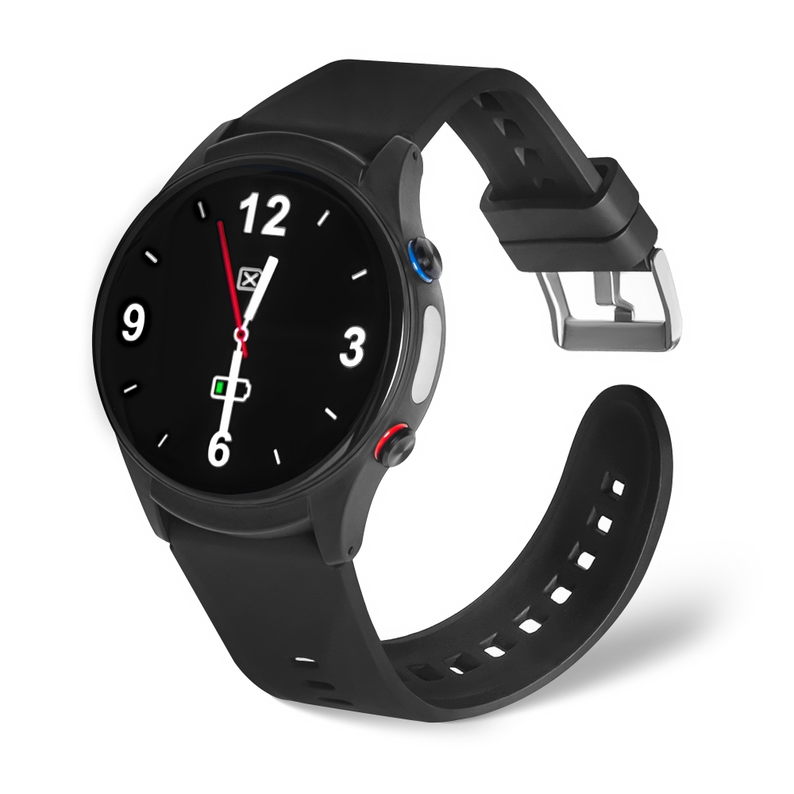

# GOTOP - L08P

The GOTOP L08P is a rugged, health focused 4G GPS smartwatch designed for dependable personal tracking and emergency support. Built for continuous wear, the device combines a bright 1.43 inch AMOLED touchscreen with an IP66 rated enclosure, providing practical durability and visibility for seniors, people with cognitive impairment, lone workers, and others who need regular location and health monitoring.

As an out of the box Plaspy compatible tracker, the L08P transmits real time position, safety events, and health telemetry to monitoring platforms. Its connectivity options and built in sensors make it suitable for caregivers and operations teams who need location history, immediate SOS alerts, and ongoing visibility within Plaspy for timely responses and reporting.

## Key Highlights

- Plaspy compatible wearable that integrates location, safety events, and health telemetry for caregiver and fleet oversight.
- Real time GNSS location tracking across multiple constellations for consistent positioning indoors and outdoors.
- Built in health telemetry including heart rate, SpO2, optional ECG, blood pressure estimation, and step counting to support monitoring workflows.
- Flexible connectivity with cellular support, eSIM and nano SIM options, 2.4 GHz WiFi, and BLE for remote data delivery and local integrations.
- Dedicated SOS button and two way calling for immediate incident escalation and voice contact through monitoring teams.
- Rugged design with IP66 resistance, durable casing, and OTA update support to simplify maintenance at scale.

## How It Works with Plaspy

When connected to Plaspy, the L08P functions as a real time location and telemetry node, forwarding positions, health metrics, and safety events so teams can monitor assets and people from a central platform. Plaspy receives alarms and telemetry for routing, history playback, and configurable notifications that support fast operational decisions.

- Continuous location and telemetry updates delivered to Plaspy for live tracking and historical playback.
- SOS alarms, geo fence notifications, and low battery alerts routed to Plaspy dashboards and notification channels for rapid response.
- Health data such as heart rate, SpO2, and optional ECG forwarded as telemetry for caregiver review and event triggered alerts.
- Remote device maintenance and configuration via OTA firmware updates and WiFi to keep fleets current and reduce onsite visits.
- BLE support enables proximity or local sensor integrations that can trigger events inside Plaspy for expanded monitoring scenarios.

## Typical Use Cases

- Senior care and dementia support where continuous location and SOS alerts help caregivers maintain safety and oversight.
- Personal safety and lone worker protection with two way calling and geo fencing tied into central monitoring workflows.
- Remote health monitoring where routine telemetry and incident alerts are shared with care teams or family members.
- Healthcare service deployments that require scalable device management and incident driven escalation through a compatible platform.
- Family safety and peace of mind for monitoring vulnerable relatives with location history and event notifications.

## Why Choose This Tracker with Plaspy

The L08P pairs wearable comfort with the connectivity and telemetry modern monitoring platforms expect. Its combination of real time tracking, health sensors, emergency features, and remote update capability makes it a practical option for organizations and families that want continuous visibility without complex on site management. As a Plaspy compatible tracker, it fits naturally into workflows for alarm routing, reporting, and operational oversight.

To learn more about how Plaspy can work with devices like the GOTOP L08P, visit https://www.plaspy.com. Product specifications, availability, and manufacturer details can change over time, so please verify current technical information and compatibility on the manufacturer site https://www.gotop.cc/.
