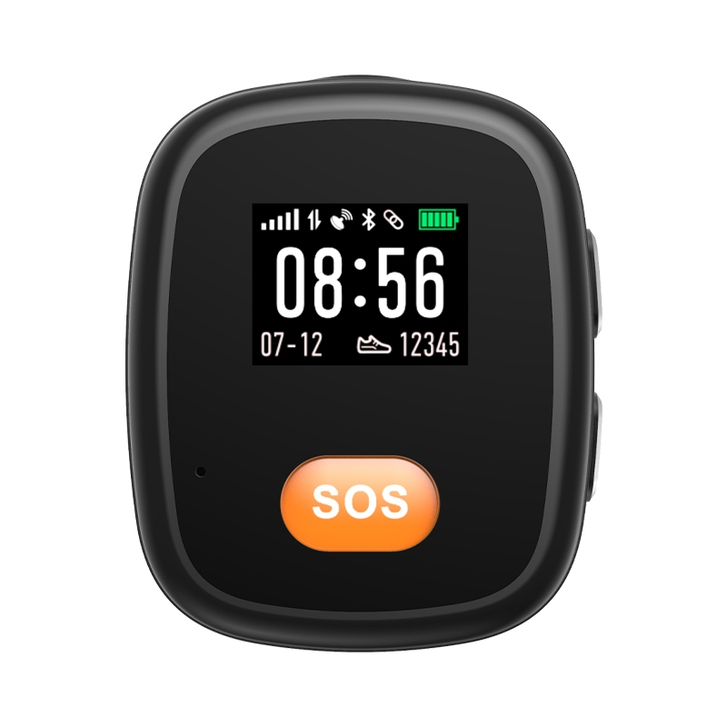

# GOTOP - L15

The 4G Pendant GPS L15 is a Plaspy compatible, wearable GPS tracker engineered for eldercare and personal emergency response. Compact and rugged, the L15 combines a Qualcomm-capable 4G SIM7500A module with dual LDS GPS/GSM antennas, BLE 5.0 and Wi‑Fi/LBS support to deliver reliable real-time tracking, clear two-way calling and emergency SOS alerts that integrate directly into the Plaspy platform for caregiver monitoring and alerting.

Designed for everyday wear, the L15 pendant balances long battery life and simple usability with safety-focused features such as a large speaker for voice communications, one-touch SOS, IP67 water resistance and optional health sensors. As a Plaspy compatible GPS tracker, it brings location, basic telemetry and event alerts into Plaspy dashboards and workflows so care programs can monitor location, activity and emergency events in real time.

## Key Highlights

- Plaspy compatible pendant GPS tracker for real-time tracking and emergency response.
- 4G connectivity \(SIM7500A\) with GPS, Wi‑Fi, LBS and BLE 5.0 for hybrid indoor/outdoor location accuracy.
- One-touch SOS, two-way calling and a large speaker enable clear voice communication in emergencies.
- Long-lasting 1000mAh battery with 3–4 days heavy use, up to 6–7 days standby on 4G.
- Rugged, water-resistant IP67 enclosure and compact form factor for daily wear.
- Optional infrared temperature sensor, step counting and activity reminders to support caregiver telemetry.
- Replaceable nano SIM slot and magnetic 2‑pin charging for convenient field use.

## How It Works with Plaspy

The L15 transmits location and telemetry to Plaspy over its 4G cellular link \(SIM7500A\) and supplements outdoor GPS with BLE, Wi‑Fi and LBS for improved indoor/hybrid positioning. Plaspy ingests the device’s GPS coordinates, battery and sensor telemetry, SOS events and activity reports so caregivers receive real-time alerts, location history and status updates through the Plaspy interface or mobile apps.

- Real-time location and telemetry updates via 4G \(SIM7500A\) with GPS and dual LDS antennas.
- SOS event reporting plus two-way voice calls routed for caregiver response and verification.
- Battery level and charging status for remote monitoring of device availability.
- Activity and motion data from the 3D accelerometer \(step counting, movement events, fall detection workflows as configured in Plaspy\).
- BLE 5.0 support for indoor positioning and for pairing Bluetooth sensors or beacons to improve accuracy.
- Optional infrared temperature readings and periodic notifications for wellbeing monitoring.
- Replaceable nano SIM enables straightforward provisioning and carrier management within Plaspy.

## Technical Overview

| Model | L15 USA |
| --- | --- |
| Connectivity | 4G module: SIM7500A; WCDMA and GSM fallback |
| Bands | LTE B2 / B4 / B12; WCDMA B2 / B5; GSM 850 / 1900 MHz |
| GNSS | GPS via SIM7500A with dual LDS GPS/GSM antennas |
| Bluetooth | BLE 5.0 for indoor positioning and sensor pairing |
| Display | 1.0" LCD, 128 × 96 pixels |
| Power & Battery | 1000mAh Li‑polymer battery; 3–4 days heavy use, 4–5 days normal use, up to 6–7 days standby \(4G\); magnetic 2‑pin charging |
| Buttons & Interfaces | SOS button, power key, call key; nano SIM slot \(replaceable\); large speaker for two-way calling; magnetic charging port |
| Sensors | 3D accelerometer \(DA217 or TBD\); optional infrared temperature sensor; step counting |
| Waterproof & Housing | IP67; PC+ABS enclosure |
| OS | RTOS \(ThreadX\) |
| Dimensions & Weight | 55 × 45 × 15.5 mm; product weight 40 g; package weight 120 g |
| Package Contents | L15 tracker, User Manual \(English\), Needle, USB Cable, Gift Box |
| Remote Management | Not specified \(RTOS ThreadX reported; FOTA/management tools not listed\) |

## Use Cases

- Eldercare monitoring: SOS alerts, real-time tracking and daily activity reminders for assisted living residents and home care clients.
- Personal safety for vulnerable adults: immediate two-way communication and emergency location reporting to caregivers or response centers.
- Care program telemetry: periodic health and activity notifications, optional temperature sensing and step counts to help caregivers track wellbeing trends.
- Active seniors and lone individuals: a compact, water-resistant pendant for peace of mind during daily outings or light exercise.

## Why Choose This Tracker with Plaspy

The L15 pendant GPS tracker is a purpose-built, Plaspy compatible device that prioritizes usability, dependable real-time tracking and emergency communications. Its 4G SIM7500A connectivity, dual LDS antennas and BLE 5.0 provide strong outdoor accuracy and improved indoor performance when used with Plaspy’s hybrid location capabilities. Care programs benefit from receiving SOS events, voice confirmations and simple telemetry in a single platform, while the durable IP67 enclosure and multi-day battery life reduce maintenance overhead.

While the L15 is optimized for personal safety rather than vehicle telemetry, it integrates into Plaspy alongside other trackers to support broader management objectives such as coordinated response, anti-theft workflows and centralized device monitoring. Choose the L15 with Plaspy for a compact, reliable GPS tracker that delivers clear two-way communications, dependable real-time tracking and caregiver-focused features for eldercare and personal emergency response.

