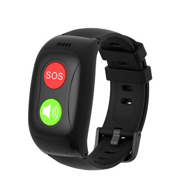

# GOTOP - L17

The L17 is a compact 4G SOS GPS smart bracelet built for personal safety and health monitoring. Designed in a wristwatch form factor \(IP67\), the L17 combines reliable GNSS positioning, LTE cellular connectivity, and optional Bluetooth sensors to deliver Plaspy compatible real-time tracking and telemetry for children, seniors, lone workers, and general personal asset protection.

The device pairs sensor-rich health tracking \(heart rate, SpO2, blood pressure and temperature\) with an SOS button and two-way calling for immediate response. With long battery life, nano-SIM / eSIM support and global LTE/GSM band coverage, the L17 is ideal where continuous location, emergency alerts and compact wearable telemetry are required.

## Key Highlights

- Plaspy compatible GPS tracker: delivers real-time tracking and telemetry to Plaspy for alerts, history and reports.
- 4G LTE connectivity with global band support: reliable cellular positioning and data transmission for wide-area coverage.
- Integrated health sensors: heart rate, SpO2, blood pressure and temperature combined with activity/fall detection.
- SOS and two-way calling: one-touch emergency alerting plus voice communication to assist in critical events.
- Compact, waterproof wearable: IP67 wristwatch form factor for continuous personal use and comfortable daily wear.
- Optional BLE 5.0: local Bluetooth sensors and beacons can extend telemetry and short-range monitoring.
- Server-side history and alarms: geo-fencing, low-battery and SOS alarms with 30-day server storage for audit and review.

## How It Works with Plaspy

The L17 sends GNSS location fixes and sensor telemetry over its LTE cellular link to cloud services. When configured with Plaspy, those data streams feed into Plaspy’s real-time tracking dashboard, alarm engine and historical reports so you can monitor location, health events and SOS alerts from a single interface.

- Real-time location and telemetry updates: GNSS fixes \(MTK3333\) transmitted over LTE provide live position on Plaspy maps.
- SOS and voice events: SOS button presses and two-way calls generate instant alerts that Plaspy can forward to responders.
- Health and activity telemetry: heart rate, SpO2, blood pressure, temperature and accelerometer-based activity/fall data are available to Plaspy for monitoring and triggers.
- Bluetooth sensors: optional BLE 5.0 enables short-range beacons or sensors; paired data can be relayed to Plaspy for expanded telemetry.
- Historical tracking & geo-fencing: device history and geo-fence events are stored \(up to 30 days on server\) and viewable in Plaspy for compliance and review.

## Technical Overview

| Connectivity | 4G LTE \(Unisoc UIS8910 CAT1, Cortex A5 500MHz\); GSM fallback |
| --- | --- |
| Bands | GSM 850/900/1800/1900; LTE B1/B3/B7/B8/B38/B39/B40/B41 |
| Power & Battery | 680 mAh Li‑Po battery; magnetic 2‑pin charging; typical 3–4 days \(very frequent use\), 4–5 days \(normal use\), 6–7 days standby with 4G |
| Interfaces | Nano SIM / eSIM compatible; SOS button; power button; two-way calling support |
| GNSS | MTK3333 GNSS module \(GPS positioning\) |
| Bluetooth | Optional BLE 5.0 for short-range sensors and beacons |
| Sensors | Heart rate \(PAH8009 or equivalent\), SpO2, blood pressure, temperature \(NST117\), 3D accelerometer \(DA217\) for activity/fall detection |
| Software & Management | RTOS \(ThreadX\); managed via web or mobile app \(Android 4.4 / iOS 7.0+\); server-side data storage up to 30 days |
| Form Factor | Wristwatch, IP67; dimensions 55 × 31 × 14.8 mm; weight 40 g; PC+ABS+LDS watch case; 18 mm silicone strap |
| Package Contents | L17 GPS smart watch, user manual \(English\), screwdriver, pin, EU/UK adaptor, gift box |

## Use Cases

- Child safety: real-time GPS tracker on the wrist, SOS button and geofence alerts for parents and guardians.
- Elderly fall and health monitoring: heart rate, SpO2, blood pressure and fall detection feed telemetry to caregivers via Plaspy.
- Lone worker protection: compact wearable for workers who need emergency alerts, two-way calling and location tracking.
- Personal anti-theft / asset protection: wearable tracking and SOS capability for high-value personal items and travelers.
- Short-range sensor monitoring: BLE sensors for local telemetry \(e.g., proximity beacons or environmental sensors\) integrated into Plaspy dashboards.

## Why Choose This Tracker with Plaspy

Integrating the L17 with Plaspy gives you a Plaspy compatible wearable that focuses on reliable personal safety and health telemetry rather than vehicle-focused features. Use the L17 when you need accurate GNSS location, cellular-backed real-time tracking, and sensor-rich health data from a comfortable wrist device. Its SOS button, two-way calling and server-side history make it straightforward to manage incident response and audit trails.

For organizations and families that rely on Plaspy for dashboards, alerts and reporting, the L17 offers a compact, sensor-packed GPS tracker that simplifies deployment and ongoing management. While the L17 is optimized for people-first applications, its BLE capability and robust cellular bands enable flexible telemetry integration—useful in scenarios where asset-level monitoring or proximity sensor data must be combined with location and emergency events.

