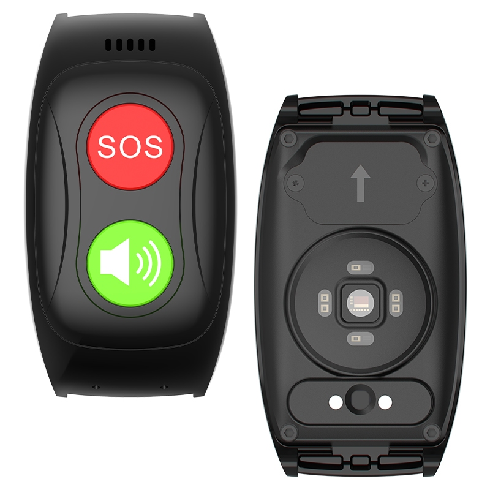

# GOTOP - L17 PRO

# L17 PRO GPS Smart Watch

The L17 PRO is a compact, Plaspy compatible GPS tracker in smartwatch form — engineered for reliable personal tracking, health telemetry and emergency assistance. With a dual-CPU architecture \(Unisoc W307 Cortex-A53 plus GR5515 BLE hub\), global cellular roaming \(2G/3G/4G\), Wi‑Fi and BLE 5.0, the L17 PRO delivers accurate real-time tracking and responsive SOS alerts while preserving battery life for daily wear.

The device pairs seamlessly with Plaspy for live location, activity and vital-signs monitoring through mobile and web dashboards. Lightweight \(40 g\), IP66 rated and featuring two-way calling plus an SOS button, the L17 PRO is designed for elder care, child safety, lone-worker protection and international personal tracking where dependable location, health metrics and emergency connectivity are required.

## Key Highlights

- Plaspy compatible for real-time tracking and remote monitoring via mobile and web apps.
- Global roaming on 2G/3G/4G networks \(nano SIM + eSIM compatible\) for international coverage.
- Integrated health telemetry: heart rate \(PPG\), SpO2 and temperature sensors with activity tracking.
- Dedicated SOS button and two-way calling for immediate emergency communication and anti-theft response.
- BLE 5.0 and Wi‑Fi for improved indoor positioning and Bluetooth sensors connectivity.
- Long-lasting 680 mAh battery with 4–5 days typical use \(4G\) and 6–7 days standby.
- Durable, everyday wear: IP66 water resistance, compact dimensions and lightweight design.

## How It Works with Plaspy

When the L17 PRO is registered to your Plaspy account, the watch streams location and telemetry to Plaspy’s cloud for visualization, alerts and historical reporting. Plaspy receives GPS fixes from the W307 module, BLE-assisted indoor positions, and on-demand health data, then consolidates those signals into configurable dashboards and automated notifications.

- Real-time location and telemetry updates via cellular \(2G/3G/4G\) and Wi‑Fi.
- SOS alarm and two-way call events routed to Plaspy for immediate notification and response workflows.
- Health metrics: heart rate \(PPG\), SpO2 and temperature are available as telemetry streams for monitoring and incidents.
- BLE 5.0 for indoor positioning and Bluetooth sensors/beacons detection to enhance accuracy in buildings.
- Geofence, low-battery and alarm notifications supported through Plaspy using the watch’s onboard alerts.
- Temporary server storage of device data \(30 days\) enables short-term history and playback inside Plaspy dashboards.

Note: the L17 PRO is a personal GPS tracker and smartwatch; it does not provide vehicle-specific telemetry such as ignition, immobilizer control or fuel monitoring. Plaspy, however, supports those vehicle telemetry features when paired with appropriate Plaspy compatible vehicle trackers.

## Technical Overview

| Model | L17 PRO |
| --- | --- |
| CPU | Unisoc W307 \(Cortex-A53 1GHz\) + GR5515 BLE sensor hub |
| GNSS / GPS | W307 GPS chip with LDS antenna \(real-time positioning\) |
| Connectivity | 2G / 3G / 4G cellular roaming, Wi‑Fi |
| GSM Bands | 850 / 900 / 1800 / 1900 MHz |
| 3G Bands | WCDMA Band 1 / Band 8 |
| LTE Bands | B2 / B4 / B7 / B12 / B17 / B66 |
| Bluetooth | BLE 5.0 \(GR5515 hub\) |
| Sensors | PPG heart rate, SpO2, NST117 temperature sensor, 3D accelerometer |
| Battery | 680 mAh Li‑Polymer \(typical 4–5 days use on 4G; standby 6–7 days\) |
| Water Resistance | IP66 |
| Dimensions & Weight | 55 x 31 x 14.8 mm; 40 g |
| Buttons & I/O | SOS button + function key; magnetic two‑pin charge port; nano SIM slot \(eSIM compatible\) |
| Software | RTOS \(ThreadX\); mobile/web app connectivity; temporary server storage 30 days |
| Materials & Strap | PC+ABS+LDS case; 18 mm silicone strap |
| Package Contents | 1 × L17 PRO GPS Smart Watch; User Manual \(English\); Screwdriver; Pin; EU/UK adaptor; Gift Box |

## Use Cases

- Elder care monitoring — continuous location, fall/activity tracking and health telemetry with SOS escalation through Plaspy.
- Child safety and parental tracking — geofence alerts, real-time tracking and two-way calling for direct communication.
- Lone worker protection — position updates, SOS alerts and vital-signs telemetry for remote worker safety in the field.
- International personal tracking — global roaming and eSIM support make the L17 PRO suitable for travelers and cross-border deployments.
- Everyday wellness and activity tracking — PPG, SpO2, temperature and step/activity logs integrated into Plaspy for consolidated monitoring.

## Why Choose This Tracker with Plaspy

Choosing the L17 PRO as a Plaspy compatible GPS tracker gives organizations and families a compact, reliable solution for real-time tracking, health telemetry and emergency response. Its combination of global cellular connectivity, BLE-assisted indoor location, and built-in SOS/two-way calling creates a single device that covers location accuracy, personal safety and basic medical telemetry. Plaspy adds value by centralizing location, telemetry and alerts into scalable dashboards and workflows, so administrators can manage devices at scale while users benefit from fast incident response.

For deployments that require vehicle telemetry such as ignition, immobilizer or fuel monitoring, Plaspy supports those features with dedicated vehicle trackers. For personal tracking and anti-theft scenarios that rely on portable GPS tracker form factors, the L17 PRO strikes a balance of battery life, comfort and connectivity that fits elder care, child safety, lone-worker protection and international use cases.

