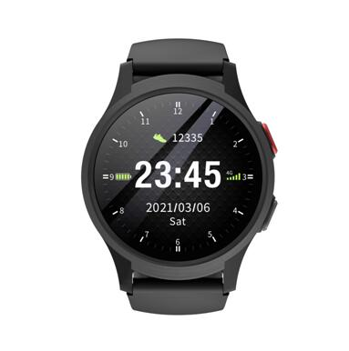

# GOTOP - L18

The GOTOP L18 is a compact 4G LTE GPS tracker built as a smartwatch and engineered for personal safety, health monitoring, and two way communication. It combines multi constellation positioning, multi band cellular connectivity with optional eSIM, an SOS emergency key and a suite of health sensors to deliver continuous location and wellbeing data from a wearable form factor suited to caregivers, field staff and organizations needing reliable person centric tracking.

As a Plaspy compatible device, the L18 can stream location fixes, SOS alerts and health telemetry into the Plaspy platform for real time monitoring, alerting and reporting. Its wearable design and integrated communications make it practical for personnel monitoring, attendance verification and personal emergency response workflows that benefit from Plaspy visibility and operational oversight.

## Key Highlights

- Wearable 4G LTE GPS tracker in a smartwatch form factor for discreet continuous tracking.
- Multi constellation GNSS support for improved location reliability in mixed environments.
- Integrated health telemetry including heart rate, blood pressure and SpO2 for wellbeing monitoring.
- SOS emergency button and two way voice calling for immediate incident notification and verification.
- Optional eSIM and multi band cellular connectivity to reduce coverage gaps in many regions.
- IP67 rated durability and compact lightweight design for daily wear in field and care settings.
- Remote device management and firmware updates plus cloud data delivery for centralized oversight.

## How It Works with Plaspy

When deployed with Plaspy, the L18 delivers location and sensor data to the platform so managers and responders can view live positions, receive emergency alerts and review health telemetry in near real time. Plaspy ingests device events and telemetry and presents them through mapping, alerts and historical reports to support dispatch and operational decisions.

- Continuous or periodic location updates and telemetry streamed from the watch into Plaspy for live tracking.
- SOS alerts and two way voice events surface as high priority notifications in Plaspy dashboards and mobile alerts.
- Health metrics such as heart rate, blood pressure and SpO2 appear as telemetry streams and can trigger event driven alarms.
- Geofence, low battery and SOS events become actionable alerts for dispatching and incident workflows.
- Historical location and event data are available for reporting, audit and operational analysis within Plaspy.

## Typical Use Cases

- Elder care and personal emergency response to monitor location and health status for caregivers and family.
- Workforce attendance, location verification and remote check ins for field staff and urban management teams.
- Guided tours and visitor safety to provide SOS support and two way voice for vulnerable groups.
- Personnel tracking that complements vehicle telematics by monitoring staff movement and wellbeing on site.
- On site monitoring for assisted living, healthcare or security operations that need consolidated telemetry and alerts.

## Why Choose This Tracker with Plaspy

The L18 pairs wearable convenience with a practical sensor set and cellular flexibility, making it a sensible choice for organizations that need person centric tracking alongside health telemetry. Its SOS and two way voice features support faster incident confirmation while multi constellation positioning and broad cellular options help maintain visibility in urban or mixed coverage areas. When combined with Plaspy, the L18 provides teams with mapped locations, alerts and historical context to support response, compliance and operational reporting.

To learn more about Plaspy and how compatible devices like the GOTOP L18 fit into fleet and personnel monitoring workflows visit https://www.plaspy.com. Product specifications and availability can change over time, so please verify current technical details and manufacturer information on the GOTOP website https://www.gotop.cc/.
