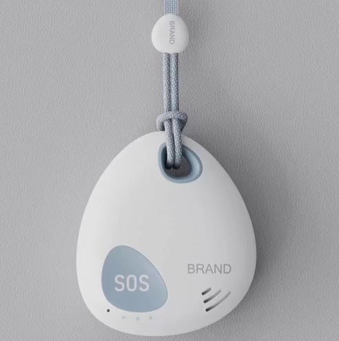

# GOTOP - Q10

The SOS GPS Tracker Q10 is an ultra-compact, Plaspy compatible GPS tracker engineered for dependable personal safety and simple real-time tracking. Designed around a prominent SOS button, waterproof enclosure and an included holder, the Q10 is ideal for protecting children, the elderly, lone workers, pets and other vulnerable users who need an unobtrusive, easy-to-carry safety device. Its compact size and intuitive features make it a practical addition to any Plaspy deployment for personal security and small-asset tracking.

Built for flexible reporting, the Q10 supports SMS coordinate replies \(with clickable Google Maps links\), direct location queries from authorized phone numbers, and continuous GPRS reporting to a server or platform such as Plaspy for telemetry, alerts and historical playback. With voice surveillance and two‑way calling, motion-sensing power saving, Bluetooth connectivity and geo-fence alarms, the Q10 delivers essential situational awareness in a small package.

## Key Highlights

- Plaspy compatible: real-time tracking via GPRS to your Plaspy server or platform for live maps and reporting.
- Dedicated SOS button for immediate emergency alerts to authorized contacts.
- Multi-mode reporting: SMS with Google Maps links, GPRS tracking, and direct phone query responses.
- Voice surveillance and two-way calling for remote check-ins and situation verification.
- Waterproof enclosure and compact form factor \(57 × 50 × 20 mm, 23 g\) for everyday carry and wearability.
- Low power consumption with motion sensor and up to 96 hours standby battery life for extended coverage.
- Bluetooth connectivity enabling local sensors or accessories to be paired where required.

## How It Works with Plaspy

The Q10 integrates with Plaspy using its GPRS reporting mode to stream location and status updates to your Plaspy instance or server. Configure reporting intervals over the air so the device sends periodic location updates to Plaspy for real-time tracking and historical telemetry. SMS and direct-call features provide out-of-band location checks and SOS notifications to authorized numbers when cellular data is unavailable.

- Real-time location and telemetry updates via GPRS to Plaspy for live map visualization and playback.
- SOS alerts and emergency coordinates sent to authorized numbers and available to Plaspy for alarm workflows.
- Geo-fence notifications when the device exits or enters predefined areas, configurable in Plaspy.
- Low-battery alerts forwarded to Plaspy and authorized contacts to prevent downtime.
- Voice monitoring and two-way calling accessible as event-driven communications alongside Plaspy tracking.
- Bluetooth sensor support: local BLE/connectivity data can be used alongside Plaspy records where sensor pairing is enabled.

## Technical Overview

| Model | SOS GPS Tracker Q10 |
| --- | --- |
| Connectivity | GSM / GPRS \(SMS and data reporting\) |
| Bands | 850 / 900 / 1800 / 1900 MHz |
| GNSS | U‑blox GPS chipset; accuracy 5–20 m; sensitivity −159 dBm |
| Cold / Warm / Hot Start | Cold: 42 s · Warm: 35 s · Hot: 1 s |
| Power & Battery | Standby battery life up to 96 hours; USB charging connector included |
| Sensors & Interfaces | Dedicated SOS button, built‑in motion sensor, voice surveillance and two‑way calling |
| Bluetooth | Bluetooth connectivity supported \(for local accessory/sensor pairing\) |
| Enclosure & Form Factor | Waterproof, ultra‑compact: 57 × 50 × 20 mm; weight 23 g; includes holder bag |
| Reporting Methods | SMS with coordinates and Google Maps link; GPRS real‑time reporting to server/platform; direct location query by authorized phone numbers |

## Use Cases

- Child and elderly protection — discreet carry with SOS and voice monitoring for immediate response.
- Lone worker safety — check-in calls, SOS alarms and geo-fence alerts for remote personnel oversight.
- Pet tracking — lightweight, waterproof tracking for pets with periodic location updates.
- Personnel management and personal security — on-demand location queries and continuous real-time tracking using Plaspy.
- Small-asset protection — compact form and anti-loss alerts where continuous connectivity is required.

## Why Choose This Tracker with Plaspy

The Q10 is a focused personal GPS tracker that combines essential safety features with Plaspy-compatible real-time tracking. For organizations and caregivers who need reliable location awareness rather than vehicle-level telemetry, the Q10 provides a lightweight, waterproof option with SOS, voice monitoring and flexible reporting modes. When paired with Plaspy, Q10 data appears on live maps and in reports, enabling rapid incident response and consistent historical tracking.

While the Q10 excels at personal safety, Plaspy also supports broader fleet management and telemetry workflows when paired with trackers that expose additional I/O such as ignition, immobilizer or fuel monitoring inputs. For teams that need integrated anti-theft workflows or advanced telemetry \(fuel monitoring, ignition status, immobilizer control\), Plaspy can centralize those signals alongside Q10 personal-tracking feeds, delivering a unified view of both people and assets. The result is a scalable, secure monitoring solution that balances compact hardware with the Plaspy platform’s real-time insights.

Packaging includes the Q10 device, USB charging connector, holder bag, user manual and screwdriver — everything needed to deploy quickly. Choose the SOS GPS Tracker Q10 for a Plaspy compatible, compact solution that prioritizes personal safety, reliable real-time tracking and straightforward configuration.

