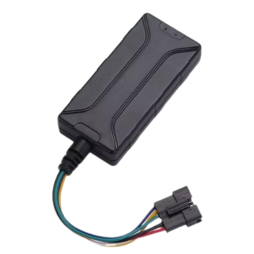

# GOTOP - R18

The R18 is a compact 4G GPS tracker from GOTOP designed for versatile vehicle and asset tracking. It is built for motorcycles, cars, boats and general asset protection, featuring a rugged industrial form factor and internal antennas to simplify installation and reduce visibility. The device supports a wide DC input range and offers multiple tracking modes and alarm options that suit both commercial fleet use and personal security needs.

As a Plaspy compatible device, the R18 supplies the core location and event data Plaspy needs for real-time monitoring, historical playback and automated alerts. Its feature set is tuned for fleet management and anti theft workflows, making it a practical choice for operators who want straightforward integration with Plaspy to gain visibility, event notifications and long term reporting across vehicles and assets.

## Key Highlights

- Compact 4G GPS tracker designed for discreet mounting on motorcycles, cars, boats and general assets.
- Wide DC input range that supports varied vehicle and marine power systems without extra converters.
- Internal GPS and GSM antennas with a rugged industrial housing to simplify deployment and reduce exposure.
- Multiple telemetry modes including real time and interval tracking to balance update frequency and data needs.
- Comprehensive alarm suite such as SOS, geo fence, power cut and harsh driving alerts for security workflows.
- Optional relay based remote engine stop support when deployed with compatible accessories.
- Built in backup battery for short runtime during temporary power loss to preserve location reporting.

## How It Works with Plaspy

When connected to Plaspy, the R18 delivers continuous location and event telemetry that Plaspy ingests, normalizes and presents through maps, dashboards and reports. Plaspy uses the R18 data to drive alerting, route playback and operational insights, helping teams monitor assets and respond to incidents.

- Real time location updates and periodic telemetry for live fleet visibility and route history.
- Event forwarding to Plaspy for alarms such as SOS, geo fence breaches and power loss so teams can act quickly.
- Ignition and engine on off events available to support idling, usage and driver behaviour reporting.
- Analog input telemetry can be used for voltage based sensors so Plaspy can include additional vehicle metrics in dashboards.
- Remote immobilization workflows can be integrated where relay based engine stop is supported and permitted, enabling theft response from the platform.

## Typical Use Cases

- Fleet management for cars, light trucks and motorcycles with route monitoring and driver behaviour insight.
- Anti theft monitoring with power cut and SOS alerts plus optional immobilization workflows.
- Motorcycle and small vehicle tracking where compact size and discreet placement are priorities.
- Boat and marine asset visibility where wide voltage tolerance and reliable location reporting are required.
- Voltage based telemetry such as fuel level monitoring integrated into Plaspy dashboards for operational oversight.

## Why Choose This Tracker with Plaspy

The GOTOP R18 pairs a small footprint with practical telemetry and alarm features that align well with Plaspy platform capabilities. Organizations that need straightforward, scalable tracking for mixed fleets and varied asset types will find the R18 provides the essential inputs Plaspy requires for mapping, alerts and reporting without unnecessary complexity.

Plaspy can ingest the R18’s location and event data to deliver operational visibility, historical analysis and automated notifications that support fleet efficiency and asset security. For more information about Plaspy and how the platform works with compatible devices, learn more at https://www.plaspy.com. Product specifications and availability can change over time, so please verify current device details on the manufacturer site https://www.gotop.cc/.
