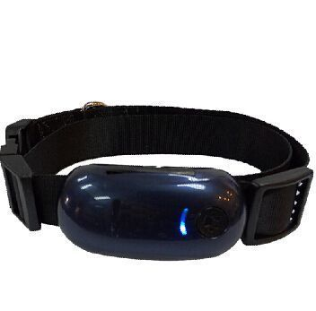

# GOTOP - TK-100

The GOTOP TK-100 is a compact tracking device built for pet GPS protection. It provides real-time location updates using SMS or GPRS and includes a set of alarms such as geo-fencing, low battery, vibration, and movement to alert owners to important events. The device is designed to withstand outdoor conditions with a waterproof and dustproof enclosure, and it is accompanied by online tracking software and an Android app for remote monitoring and history review.

As a device compatible with Plaspy, the TK-100 can be integrated into a broader monitoring workflow to provide centralized visibility of pet movements alongside other tracked assets. Plaspy can surface the TK-100’s location updates, geo-fence events, and alarm notifications in a single dashboard, helping owners and operators turn raw location data into actionable information for safety and oversight.

## Key Highlights

- Purpose built for pet GPS protection with real-time location updates via SMS or GPRS
- Waterproof and dustproof design suitable for outdoor use and active pets
- Geo-fencing alarm to notify when a pet leaves a predefined area
- Multiple alert types including low battery, vibration, and movement alarms
- Online tracking software and an Android app for live monitoring and history
- Simple feature set that focuses on location visibility and event notifications

## How It Works with Plaspy

When connected to Plaspy, the TK-100’s location reports and alarm events become part of a unified tracking view. Plaspy ingests position and event data and presents them through maps, timelines, and notification channels so you can monitor pets alongside any other tracked items.

- Display real-time location of TK-100 devices on the Plaspy map for quick visual tracking
- Receive geo-fence and movement alerts through Plaspy notification options to respond promptly
- Review historical location data and movement history for incident review and pattern analysis
- Group and organize multiple TK-100 devices for multi-pet oversight or consolidated reporting
- Use Plaspy reporting features to export or schedule summaries of location and alarm activity

## Typical Use Cases

- Keeping close watch on household pets that spend time outdoors or in off-leash areas
- Monitoring pets during walks, travel, or outdoor recreation for added peace of mind
- Alerting caretakers or staff at pet daycare facilities when an animal crosses a boundary
- Assisting in rapid recovery efforts for lost or wandering pets with timely location updates
- Tracking activity patterns over time to better understand a pet’s typical movements

## Why Choose This Tracker with Plaspy

The GOTOP TK-100 is a practical choice when the primary requirement is reliable pet location and event notifications in a rugged package. Its waterproof construction and focused alarm features make it well suited to outdoor use, while the included online software and Android app indicate that the device is designed for regular remote monitoring. Paired with Plaspy, organizations and pet owners gain centralized visibility and consistent alert handling, which simplifies monitoring multiple devices and responding to incidents.

If you want to learn more about how Plaspy can display and manage GOTOP TK-100 devices, visit the Plaspy website https://www.plaspy.com for platform information and contact options. Product specifications, availability, and manufacturer details can change over time; for the most current technical information about the TK-100 please verify specifications on the manufacturer site https://www.gotop.cc/.
