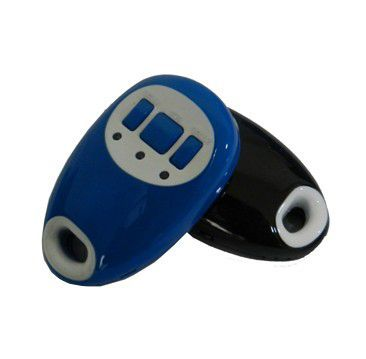

# GOTOP - TL-201

The GOTOP TL-201 is a compact GPS tracker designed for personal positioning, pet monitoring, and basic vehicle security. It uses GPS satellites together with the GSM GPRS network to provide location updates, and its small form factor makes it easy to carry or attach to items such as keychains or collars. The TL-201 can transmit longitude and latitude information via SMS or GPRS and can reply with a Google Maps link for quick visual location checks on a smartphone.

As a Plaspy compatible device, the TL-201 can provide location and event data that Plaspy can use for mapping, monitoring, and alerting. Whether the tracker reports location via SMS or GPRS, Plaspy can be configured to ingest those updates and surface them on live maps, include them in reports, and generate alarms for events like SOS presses or geo fence breaches. This makes the TL-201 a straightforward option for users who want a small, versatile tracker integrated into Plaspy fleet and asset workflows.

## Key Highlights

- Compact and lightweight design suitable for personal carry and pet attachment
- Supports location reporting via SMS or GPRS for flexible connectivity
- Sends Google Maps links in SMS replies for quick smartphone viewing
- Voice surveillance and two way communication for situational awareness
- SOS button provides an emergency alert with location to authorized numbers
- Geo fence alarm notifies when the device moves outside a predefined area
- Low battery alert and support for up to five authorized phone numbers

## How It Works with Plaspy

When used with Plaspy, the TL-201's location and event messages can be captured and presented alongside other tracked assets to provide centralized visibility and operational insight. Plaspy can make those updates actionable with mapping, alerts, and reporting tools.

- Live map display of TL-201 location updates for real time monitoring
- Event logging for SOS presses, geo fence breaches, and low battery notifications
- Alerting rules to notify teams when the tracker sends emergency or boundary events
- Historical location reports for movement review and basic activity reporting
- Consolidation of multiple TL-201 units into Plaspy dashboards for fleet or personal asset oversight

## Typical Use Cases

- Personal safety tracking for children or vulnerable adults
- Pet location monitoring for collars and small animal recovery
- Basic vehicle security for motorcycles or occasional vehicle tracking
- Tracking of portable assets such as key equipment or bags
- Short term monitoring for rentals or temporary assignments

## Why Choose This Tracker with Plaspy

The TL-201 is a practical choice when you need a small, easy to deploy tracker that can provide basic location updates and emergency alerts. Its SMS and GPRS reporting options give flexibility for environments where different communication methods are preferred, and features such as SOS, geo fence alerts, and authorized number management align well with Plaspy's monitoring and notification capabilities.

Because the TL-201 focuses on straightforward location reporting and safety features, it pairs neatly with Plaspy for users who want centralized visibility without complex integration needs. If your requirements center on compact form factor, simple event alerts, and standard location reporting, this tracker is worth considering as part of a Plaspy managed solution.

To learn more about how Plaspy can work with trackers like the GOTOP TL-201, visit the Plaspy main website at https://www.plaspy.com. Product specifications and availability can change over time, so please verify current details on the manufacturer site https://www.gotop.cc/ before making purchasing decisions.
