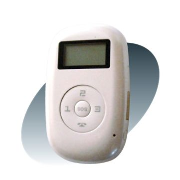

# GOTOP - TV-690

The GOTOP TV-690 is a personal remote positioning device that combines a GPS module and a GSM/GPRS module. This compact device offers high accuracy and can provide accurate and correct location information even under dynamic conditions, thanks to its reliance on GPS satellites. 

One of the key uses of the TV-690 is for the protection and tracking of elderly individuals and children. With this GPS tracker, you can ensure their safety and easily locate them if they wander off or get lost. Additionally, the TV-690 can be used for remote positioning to protect property and even track animals. 

One standout feature of the TV-690 is its ability to provide location information via text message. Simply send a text message to the tracker, and it will reply with the exact coordinates of its location. You can then input these coordinates into Google Maps on your computer or smartphone to see the precise location of the GPS tracker. Furthermore, the TV-690 supports Google map links, allowing you to receive SMS replies with a link to the detailed position information displayed directly on Google Maps. This makes it incredibly convenient and user-friendly to track and monitor the device's location.

With its compact size, high accuracy, and versatile applications, the GOTOP TV-690 is an excellent GPS gadget to have on hand. Whether you need to ensure the safety of your loved ones or protect your property, this GPS tracker offers reliable and accurate location information. Its compatibility with Google Maps adds an extra layer of convenience and ease of use. Invest in the TV-690 and enjoy peace of mind knowing that you can always keep track of what matters most to you.

### Outstanding Features:

- Compact dimensions
- High accuracy
- GPS module and GSM/GPRS module
- Provides accurate and correct location information
- Can be used to protect and track elderly individuals and children
- Supports remote positioning for property safety and animal tracking
- Ability to send and receive location information via text message
- Compatible with Google Maps for easy tracking and monitoring

