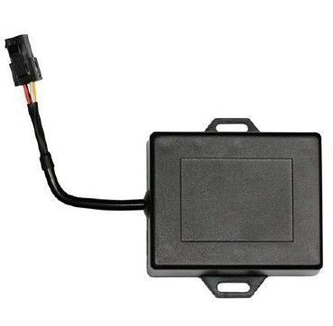

# GOTOP - VT-340

The GOTOP VT-340 is a compact, cost effective GPS tracker designed for motorcycles and cars. Its small waterproof enclosure and integrated backup battery make it suitable for vehicle security and continuous location monitoring. The VT-340 provides real time location updates and basic vehicle telemetry such as speed, direction, and odometer readings, and can report location via SMS or the GPRS data network.

As a Plaspy compatible device, the VT-340 can feed its location and alert data into Plaspy for centralized monitoring and fleet oversight. Plaspy can ingest the VT-340 position updates and alarms to present live maps, history, and notifications, making the VT-340 a practical choice for users who want affordable hardware combined with a modern tracking platform.

## Key Highlights

- Compact and water proof design suited for motorcycles and cars
- Real time tracking available over SMS or GPRS
- Multiple tracking modes including time interval, distance, or GSM base station location
- Arm and disarm functions via SMS or phone call for simple remote control
- Viewable location with a Google Maps URL for quick map checks
- Built in odometer, over speed and geo fence alert features for operational oversight
- Remote engine cut off and movement alert capabilities for security responses

## How It Works with Plaspy

The VT-340 can deliver position reports and alert messages that Plaspy uses to provide visibility and operational control across a fleet. When connected to Plaspy, the device data appears on live maps, triggers configurable alerts, and becomes part of historical reports that support daily operations and security workflows.

- Live map visualization of VT-340 position updates for real time tracking
- Configurable geofence and over speed alerts routed through Plaspy notification channels
- Historical route playback and odometer reporting to support trip review and mileage tracking
- Centralized alerting for movement, tamper, or emergency events captured by the tracker
- Remote command capability where available, enabling immobilization or configuration actions through supported channels

## Typical Use Cases

- Motorcycle theft deterrence and recovery monitoring
- Small business vehicle tracking for delivery or service fleets
- Personal car monitoring for family safety and location sharing
- Rental vehicle oversight including mileage and movement alerts
- Security response workflows that require remote alerts and immobilization options

## Why Choose This Tracker with Plaspy

The GOTOP VT-340 pairs practical, cost conscious hardware with the capabilities expected in modern tracking workflows. Its compact waterproof form factor and backup power make it a fit for two wheeler and small vehicle deployments, while its reporting modes offer flexibility for areas that rely on SMS or GPRS communication. Used with Plaspy, the VT-340's basic tracking and alert features are presented in a unified platform that supports map based monitoring, notifications, and reporting.

Organizations choosing the VT-340 with Plaspy gain a straightforward path to combine economical device hardware with a full featured tracking platform. For teams focused on security, simple remote control, and consistent location visibility, this combination provides a balanced solution without unnecessary complexity.

To learn more about Plaspy and how it can use device data for fleet tracking and security, visit https://www.plaspy.com. Product specifications, availability, and manufacturer details can change over time; please verify current VT-340 specifications on the manufacturer website https://www.gotop.cc/.
