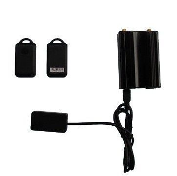

# GOTOP - VT-360A

The GOTOP VT-360A is a compact, cost effective GPS vehicle tracker designed for discreet installation in a range of vehicles. It combines location tracking with vehicle security features, functioning as both a tracker and a car alarm. Key capabilities described by the manufacturer include RFID based automatic arm and disarm, SOS emergency alerts, geo-fence and over-speed notifications, movement and door open alarms, and the ability to provide location updates via SMS or GPRS. The unit also supports remote voice monitoring, mileage reporting, and has a backup battery with anti-tamper alerts for added resilience.

As a Plaspy compatible device, the VT-360A can be integrated into centralized fleet and asset monitoring workflows. When connected to Plaspy, the tracker’s location updates, alarms, and periodic tracking records can be surfaced in one place for operational oversight. Plaspy users can use these inputs to build visibility into vehicle position, respond to safety events, and include VT-360A data in routine reporting and dispatch processes.

## Key Highlights

- Small form factor suitable for concealed installation and discreet monitoring
- RFID based automatic arm and disarm for convenient security management
- Multiple alarm types including SOS, over-speed, geo-fence, and movement alerts
- Location updates available via SMS or GPRS with Google Maps links for quick reference
- Backup battery and anti-tamper alert to notify of power cut events
- Remote voice monitoring and mileage reporting for added operational insight
- Flexible I/O with 2 inputs, 2 outputs, and 1 analog input for extended control options

## How It Works with Plaspy

When paired with Plaspy, the VT-360A’s core tracking and alarm signals can be visualized and managed from the Plaspy platform, enabling centralized fleet monitoring and alerting. Plaspy can collect the device’s periodic location records and event notifications to support live visibility and historical reporting.

- Display vehicle location and movement on Plaspy maps for real time oversight
- Surface SOS, over-speed, geo-fence, and tamper alerts as notifications inside Plaspy
- Log automatic tracking by distance or time intervals for detailed trip and mileage reporting
- Include remote monitoring events such as voice monitoring or fuel and temperature readings (optional) in dashboards and exports
- Use outputs and remote control features where supported to coordinate operational responses through Plaspy workflows

## Typical Use Cases

- Small and medium fleet management where concealed installation is preferred
- Vehicle security for taxis, rentals, or high value assets requiring alarm features
- Remote monitoring for mileage tracking and basic operational reporting
- Rapid alerting and response for emergency SOS and tamper events
- Use in mixed fleets where a compact, cost effective tracker is required

## Why Choose This Tracker with Plaspy

The GOTOP VT-360A is well suited to organizations seeking a compact tracker that combines basic GPS tracking with a comprehensive alarm feature set. Its RFID arm/disarm functionality and SOS alarm are practical for fleets that need straightforward security controls, while backup battery and anti-tamper alerts help maintain continuity of monitoring.

Paired with Plaspy, the VT-360A’s location updates and event alerts become part of a single operational view, reducing fragmentation and making it easier to manage response, reporting, and day to day oversight. For fleets that value discrete installation, alarm coverage, and the ability to capture periodic tracking and alarm events, this combination delivers practical visibility without unnecessary complexity.

Learn more about how Plaspy can work with compatible trackers on https://www.plaspy.com. Product specifications, availability, and manufacturer details can change over time; verify current technical information and options with the official manufacturer documentation at https://www.gotop.cc/
