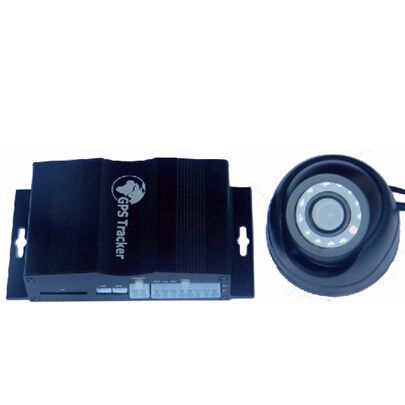

# GOTOP - VT-390

The GOTOP VT-390 is a feature rich GPS tracker designed for fleet management and vehicle security. It combines a high speed ARM9 processor with multiple inputs and outputs, an integrated driver identification system and optional camera support to provide comprehensive tracking and event logging for vehicles. The unit is positioned as a cost effective option for organizations that need continuous location monitoring, driver verification, event alarms and local data storage for images and logs.

As a Plaspy compatible device, the VT-390 can feed position, status and event information into the Plaspy fleet platform for centralized monitoring and reporting. Its support for driver identification, image capture and a variety of alerts makes it suitable for integration with Plaspy workflows for vehicle security, driver management and operational oversight. Compatibility means Plaspy can present VT-390 data alongside other devices so teams can manage mixed fleets from a single platform.

## Key Highlights

- Built for fleet management and vehicle security with driver identification support
- Camera support and SD card storage for logging images and related event data
- Two way communication capability for voice or messaging workflows where supported
- Multiple inputs and outputs plus analog channels for flexible vehicle integration
- Wide set of alerts including SOS, movement, geo fence and over speed notifications
- Features for driver behavior and vehicle health awareness such as harsh braking and acceleration alarms

## How It Works with Plaspy

When used with Plaspy, the VT-390 supplies location updates, alerts and event records that Plaspy displays and archives for operations teams. Plaspy organizes the incoming device data into dashboards, maps and reports so fleet managers can act on alarms and analyze trends over time.

- Real time location visibility on Plaspy maps for live fleet tracking and route oversight
- Driver identification logs from the VT-390 appear in Plaspy for access control and shift attribution
- Alert forwarding for SOS, geo fence, movement, over speed and harsh driving to trigger operator workflows
- Event images and stored logs from the device can be associated with incidents and reviewed in the platform
- Mileage and trip reporting used by Plaspy to support billing, maintenance planning and operational analysis

## Typical Use Cases

- Commercial delivery fleets needing location tracking, mileage reporting and driver attribution
- Vehicle security and anti theft workflows using RFID driver identification and SOS alerts
- Passenger transport or shuttle services requiring driver verification and two way communications
- Heavy vehicle or fuel sensitive operations that need fuel input monitoring and harsh driving alarms
- Incident verification by combining event imagery with location and time stamps

## Why Choose This Tracker with Plaspy

The VT-390 is well suited to organizations that want a capable hardware platform with a broad set of monitoring features. Its combination of driver identification, image logging and configurable inputs gives operations teams the raw data needed to enforce policies, investigate incidents and maintain oversight. Paired with Plaspy, the device becomes part of a managed solution that centralizes alerts, mapping and reporting for easier daily use.

Because the VT-390 supports a range of event types and local storage for images, it can be a practical choice where evidence capture and driver verification are important. Plaspy helps transform those device outputs into operational insights and scheduled reports, making it easier for fleet managers to act on the information the tracker provides.

To learn more about using VT-390 devices with Plaspy please visit https://www.plaspy.com. Product specifications, availability and manufacturer details can change over time, so please verify current technical information with the manufacturer at https://www.gotop.cc/ before finalizing any procurement or deployment decisions.
