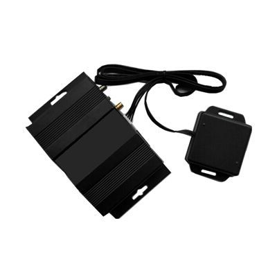

# GOTOP - VT-392

The GOTOP VT-392 is a versatile GPS tracker that offers a range of features to enhance the security and monitoring of your vehicle. With its compatibility with car alarm systems and RFID function, this tracker allows you to use your smartphone as a phone reader tag. By configuring your cell phone with the tracker, you can make it recognize your device. When you leave the car, the tracking system will automatically be armed. If someone tries to open the door, ignite the engine, or move the vehicle, you will receive a notification on your cell phone or platform, and the tracker will call your cell phone. However, when you approach the car with your recognized phone, it won't send out an alert, ensuring a seamless and convenient experience.

One of the standout features of the VT-392 is its Driver ID Identify Solution. Each authorized driver is assigned a recognized cell phone, which is connected to the tracker via a USB cable. When the recognized cell phone is in close proximity to the car, the phone reader will retrieve the identity \(ID\) number from the cell phone and send it to the server platform via GPRS. This allows the administrator to monitor the driver's ID and name from the platform. Unauthorized drivers without a recognized cell phone will not be able to turn on the vehicle engine, providing an added layer of security.

The VT-392 combines the functionalities of a driver ID identify solution, car alarm solution, and GPS tracker, making it a comprehensive and reliable device for vehicle tracking and security. Whether you're a fleet manager looking to monitor your drivers or a car owner wanting to protect your vehicle, the VT-392 offers a range of features to meet your needs.

