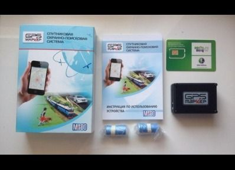

# GPSMarker - M100

The GPSMarker M100 is a highly reliable and accurate GPS tracker that offers a wide range of features to ensure the safety and security of your vehicle or valuable assets. With its 72-channel GPS receiver, it provides precise coordinates and enhances the overall performance of the tracker. This means you can track your vehicle or assets with confidence, knowing that you will always have accurate location information.

One of the standout features of the GPSMarker M100 is its long battery life, which can last up to 2 years. This means you don't have to worry about constantly recharging or replacing the battery, making it a convenient and cost-effective solution. Additionally, the M100 offers free firmware upgrades through a special cable, ensuring that you always have access to the latest features and improvements.

The M100 also includes a range of sensors that provide added security and functionality. It features a sensor for detecting the beginning of movement, allowing you to receive timely notifications if someone tries to steal your vehicle or move your assets without authorization. The crash sensor detects impacts and sends messages with the exact coordinates of the incident to registered phone numbers, enabling quick response in case of an accident. The revolution sensor measures the level of shock and can indicate how carefully your cargo is being handled during transportation.

In addition to these sensors, the GPSMarker M100 offers a panic button SOS for quickly alerting others about potential danger, a temperature sensor for monitoring the temperature around the device, and the ability to control external devices using relays. It also supports geofencing, allowing you to set up virtual boundaries and receive notifications if the tracker goes outside the specified range. With its open GPRS protocol, the M100 can easily integrate into existing monitoring systems, making it a versatile and flexible solution for various tracking needs.

Overall, the GPSMarker M100 is a feature-packed GPS tracker that combines reliability, accuracy, and advanced functionality to provide comprehensive tracking and security solutions. Whether you need to track your vehicle, monitor the temperature of your cargo, or ensure the safety of your assets, the M100 is a reliable and efficient choice.

