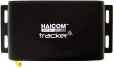

# Haicom - HI-603

The Haicom HI-603 is an all in one vehicle tracking unit that combines GPS positioning with GSM based communications, supporting SMS GPRS and DTMF operation for near real time tracking. Designed for fleet management and asset monitoring, the HI-603 family offers a range of modes and software options provided by the manufacturer so users can choose PC based DTMF tracking or web based GPRS tracking depending on their needs.

As a device compatible with Plaspy, the HI-603 can be used alongside Plaspy's fleet monitoring and reporting tools to bring live location visibility and operational oversight into a single platform. Plaspy can ingest location updates from HI-603 devices and present them in dashboards, maps, and alerting workflows so organizations can manage vehicles and respond to events from the Plaspy interface.

## Key Highlights

- Multi mode tracking support including GPS with GSM communications via SMS GPRS and DTMF for flexible connectivity options
- Manufacturer provided PC based DTMF live tracking and free web based GPRS platform for immediate use out of the box
- Ability to switch between DTMF mode and GPRS mode to suit offline or online tracking scenarios
- Features that support fleet operations such as geofencing, speed alerts, and an SOS button for immediate attention
- High sensitivity GPS chipset and built in backup battery for improved signal performance and continued reporting
- Scales from single vehicle use up to hundreds of units, making it suitable for small fleets and larger deployments
- Certified for common regulatory standards and backed by a two year warranty with 24 hour customer support from the manufacturer

## How It Works with Plaspy

Plaspy can display live and historical locations from HI-603 devices and integrate those position updates into fleet views, alerts, and reporting. Whether the device sends updates over mobile data or SMS based flows, Plaspy can consolidate that information to provide operational context for vehicle fleets.

- Centralized map view showing live positions and movement of HI-603 equipped vehicles
- Event and alert handling such as geofence breaches and speed notifications routed into Plaspy workflows
- Historical route playback and reporting for mileage audits and operational review
- Fleet status overviews and grouping to monitor vehicle availability and activity at scale
- Use of device events like SOS to trigger prioritized notifications inside Plaspy

## Typical Use Cases

- Fleet management for small to medium sized commercial vehicle operations
- Vehicle security and recovery where live location and SOS alerts are required
- Rental and loaner vehicle tracking to monitor utilization and location history
- Remote asset monitoring in urban areas or locations with partial sky visibility
- Scaling up tracking across multiple vehicles where a consistent management platform is needed

## Why Choose This Tracker with Plaspy

The HI-603 is a practical option for organizations that want a flexible tracker capable of operating in different communication modes. Its manufacturer supplied tracking tools make initial deployment straightforward, while compatibility with Plaspy means teams can migrate or consolidate tracking data into a more feature rich fleet management environment for improved oversight and reporting.

For operations that value affordability combined with multiple connectivity options, pairing the HI-603 with Plaspy gives access to centralized maps, alerting, and historical analysis without losing the native tracking choices the device offers. Plaspy helps turn the HI-603 position updates into actionable information for dispatch, compliance, and daily operations.

To learn more about Plaspy and how it can work with Haicom devices visit https://www.plaspy.com. Product specifications availability and manufacturer details can change over time so please verify current technical specifications and warranty information on the official Haicom website http://www.haicom.com.tw/.
