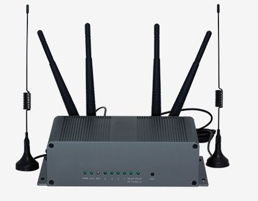

# Homtecs - G50

The Homtecs G50 is a high speed 4G LTE rugged router designed for industrial IoT and remote communications. It combines multi band mobile broadband support with an industrial grade ARM dual core communication processor and an embedded real time operating system to provide stable wireless network transmission. The device includes multiple interfaces such as four gigabit Ethernet ports, RS‑485/232 connectivity, and dual band WiFi for flexible deployment in varied environments.

Although the G50 is primarily a communications router rather than a dedicated GPS tracker, it is listed as compatible with Plaspy and can serve as a reliable network gateway for Plaspy enabled devices. Its remote management features, resilience in harsh conditions, and continuous connection capabilities make the G50 a practical option for organizations that use Plaspy for fleet monitoring, remote asset oversight, and centralized reporting.

## Key Highlights

- High speed 4G LTE mobile broadband support with multi band and multi mode coverage for broad carrier compatibility
- Industrial grade ARM dual core processor and embedded real time operating system for stable operation
- Multiple interfaces including four gigabit Ethernet ports, RS‑485/232 serial connectivity, and 2.4 GHz and 5 GHz WiFi
- Rugged metal CRS enclosure with enhanced heat dissipation and protection ratings IP34 with extendable IP51
- Built in remote management functions for parameter configuration, backup, reboot, log query, upgrading, and online monitoring
- Reliability features such as hardware and software watchdogs, multilevel link detection, fault diagnosis and automatic recovery

## How It Works with Plaspy

When used with Plaspy, the Homtecs G50 acts as a communications gateway that keeps telematics devices and edge equipment reachable and manageable from the Plaspy platform. It delivers the network continuity and remote control interfaces Plaspy relies on to collect status, operational data, and to maintain device fleets at scale.

- Provides continuous network transport for Plaspy to receive device data and status updates
- Enables remote visibility and online monitoring of connected equipment via Plaspy dashboards
- Supports remote parameter configuration, reboot, backup, log retrieval, and over the air updates to reduce on site visits
- Offers port flow detection and real time monitoring to enhance operational visibility within Plaspy reporting
- Connects serial devices and local equipment to Plaspy through serial DTU like functions and Ethernet interfaces

## Typical Use Cases

- Remote site connectivity for telemetry and equipment monitoring where cellular backhaul is required
- Industrial IoT deployments requiring a rugged communication gateway for edge devices
- Fleet or vehicle systems that need an onboard or mobile router to provide internet access for telematics and tracking endpoints
- Backup or primary connectivity for remote terminals, kiosks, or field controllers managed through Plaspy
- Centralized remote management of distributed networked devices in utilities, construction, or logistics operations

## Why Choose This Tracker with Plaspy

The G50 is a practical fit for Plaspy users who need a robust, field hardened communications gateway rather than a standalone GPS tracker. Its industrial design, multi interface options, and remote administration features help maintain connectivity for telematics endpoints and simplify fleet or site level oversight. For teams that prioritize uptime and centralized control, the G50 provides a stable network layer that complements Plaspy's monitoring and reporting capabilities.

Because the G50 focuses on reliable communications and remote management, it is particularly useful where Plaspy is used to aggregate data from multiple devices and manage distributed deployments. If your operation needs a rugged router to ensure continuous data flow into Plaspy, the Homtecs G50 is a relevant option to consider.

To learn more about how Plaspy can work with devices like the Homtecs G50 visit https://www.plaspy.com. Product specifications, availability, and manufacturer details can change over time, so verify current technical information and compatibility on the Homtecs official site http://www.homtecsm2m.com/.
