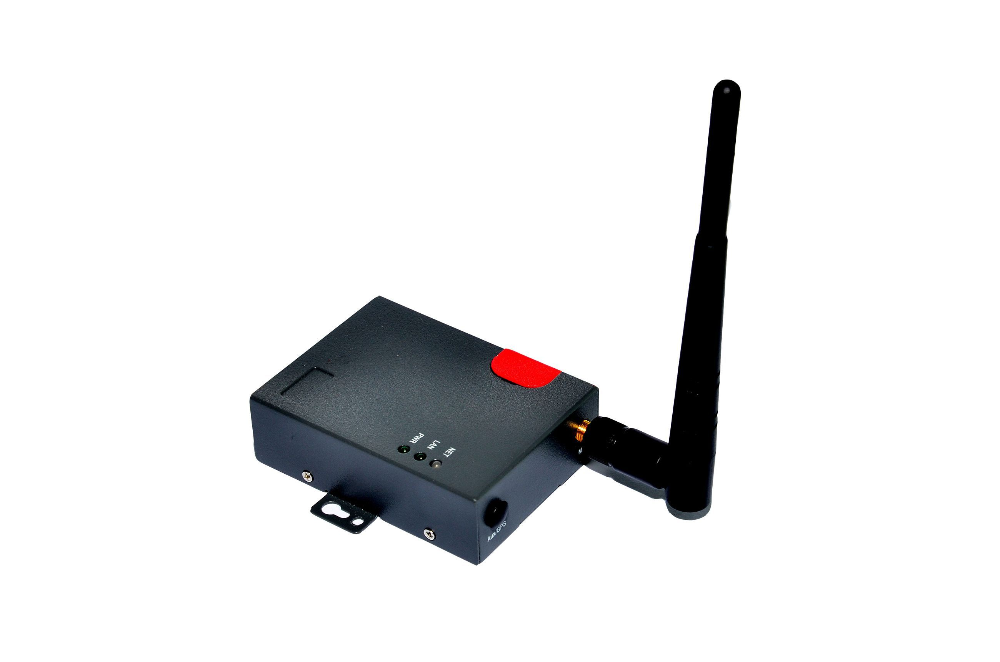

# Homtecs - H10

The Homtecs H10 is an industrial 4G router designed for demanding environments. Built in a compact metal housing and engineered for resilience, the H10 offers high speed mobile broadband connectivity with backward compatibility to earlier mobile networks. It includes a range of network functions such as DHCP, DNS, DDNS, firewall, NAT, DMZ host, and multiple VPN options, and provides operational stability through watchdog and multi link detection. Optional features include GPS capability for location tracking and DTU serial communication for integrating legacy equipment.

As a Plaspy compatible device, the H10 can serve as a reliable communications gateway for fleet and asset monitoring when GPS is present and for remote device connectivity more broadly. Plaspy can use the stable 4G link and the router's networking features to surface location, status, and connectivity information in the fleet platform. The H10's industrial design and optional GPS make it a practical choice for customers who need persistent connectivity and centralized tracking or site monitoring through Plaspy.

## Key Highlights

- Industrial grade metal housing designed for harsh environments and continuous operation
- High speed 4G mobile broadband with backward compatibility to earlier mobile networks for broader coverage
- Built in network functions including DHCP, DNS, DDNS, firewall, NAT, and DMZ host to simplify deployments
- Support for multiple VPN protocols to enable secure connectivity in distributed setups
- Watchdog and multi link detection for improved uptime and resilience
- Optional GPS capability for fleet location and tracking use cases
- Optional DTU serial communication and other modular features for flexible integration

## How It Works with Plaspy

When used with Plaspy, the H10 provides a stable connectivity layer and optional position data that Plaspy can display, report on, and use to trigger alerts. The router acts as a communications bridge between field equipment and the Plaspy platform, enabling consistent visibility and operational oversight.

- Provide continuous location feeds to Plaspy when GPS option is enabled for vehicle and asset tracking
- Maintain secure data transport to Plaspy using the router's VPN and network services
- Allow Plaspy to monitor connectivity and device health using the router's link detection and watchdog indicators
- Relay status and simple device telemetry from serial connected equipment through DTU functions into Plaspy
- Support centralized alerts and reporting in Plaspy based on connectivity, location, and availability trends

## Typical Use Cases

- Fleet tracking and management where optional GPS is required for position visibility
- Remote monitoring of charging stations and other dispersed infrastructure
- Industrial control and telemetry backhaul for sites that need robust cellular connectivity
- Environmental monitoring, public safety, and infrastructure projects requiring continuous data links
- Advertising or signage networks and other distributed assets that need managed connectivity

## Why Choose This Tracker with Plaspy

The Homtecs H10 is a practical choice for organizations that need ruggedized cellular connectivity combined with optional location services. Its broad set of network features and resilience mechanisms help keep remote devices online and provide a stable feed for Plaspy to collect, visualize, and act on operational data. Because the H10 can be configured with VPN and routing options, it fits into more secure deployments where centralized fleet oversight and reporting through Plaspy are required.

If you need a robust communications gateway that can also provide location information for fleet or asset monitoring, the H10 paired with Plaspy offers a flexible solution for industrial and distributed applications. Learn more about Plaspy and how it manages devices and fleets on the main website https://www.plaspy.com. Product specifications and available options for the Homtecs H10 can change over time, so please verify current details and configurations with the manufacturer at http://www.homtecsm2m.com/ before finalizing procurement or deployment.
