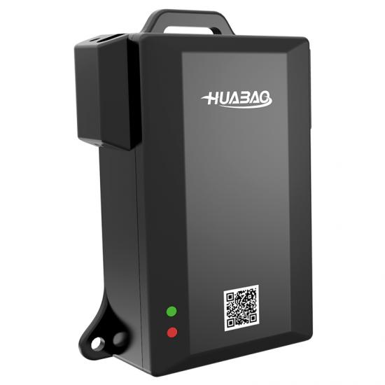

# Huabao - HB-A1Q

The HB-A1Q is a compact, economical 4G electronic seal designed for container, freight and asset protection. Built to withstand long journeys and harsh environments, the device provides real time location tracking and chain status monitoring so logistics and security teams can see position history and detect tampering events while cargo is in transit.

As a Plaspy compatible tracker, the HB-A1Q delivers its position and tamper events into Plaspy so operators can act on alerts and include seal data in fleet workflows. Its rugged form factor, long standby performance and flexible cellular options make it a practical telematics endpoint for anti theft and high visibility logistics use cases when managed through the Plaspy platform.

## Key Highlights

- Plaspy compatible electronic seal that reports real time location and tamper alerts directly to the platform
- Rugged IP65 rated housing and stainless chain with high traction for sea and cross border logistics
- Flexible cellular connectivity with optional 2G 3G 4G modules and eSIM support for regional deployments
- Long standby runtime from a 1500 mAh internal battery to support extended shipments
- Rapid chain cut and tamper detection with immediate alarm reporting for fast incident response
- Compact and lightweight design for easy attachment to containers, pallets and other assets
- GNSS positioning with GPS and BDS support for reliable fixes in logistics environments

## How It Works with Plaspy

The HB-A1Q transmits periodic location reports and immediate tamper or chain status events over cellular networks to Plaspy. Once the device messages arrive in Plaspy, they are used to populate live maps, trigger alerts, and feed historical reports and automated workflows so teams can monitor shipments and respond to incidents efficiently.

- Continuous location updates and position history displayed in Plaspy dashboards
- Immediate chain cut and tamper alarms routed to Plaspy for notification and incident handling
- Geo fence triggers and area enforcement configured within Plaspy for route compliance
- Low battery and device status alerts to help maintain operational readiness
- Seal events can be correlated with other fleet devices in Plaspy for broader operational insights

## Typical Use Cases

- Container monitoring and anti theft protection during sea and land transport
- Cross border and long haul logistics where flexible roaming and eSIM support simplify connectivity
- High security or regulated shipments such as ballot boxes and secure cargo
- Asset tracking for unsupervised items like pallets, trailers and equipment in remote handling
- Maritime and port handling where durable protection and extended standby are required

## Why Choose This Tracker with Plaspy

The HB-A1Q is a focused solution for organizations that require reliable tamper detection and continuous positional awareness for cargo and sealed assets. Its combination of rugged construction, tamper alarms and extended battery life makes it well suited to logistics operations that depend on timely alerts and uninterrupted visibility.

When integrated with Plaspy, the HB-A1Q becomes part of an operational toolkit for anti theft response and fleet oversight. Plaspy collects seal events and location data to provide live maps, alerting, and reporting, and can combine those events with other telematics devices to build comprehensive workflows without relying on large vehicle telematics hardware.

Learn more about using Plaspy with compatible devices on the Plaspy website https://www.plaspy.com. Product specifications, availability and manufacturer details can change over time, so please verify current technical information on the Huabao official site https://www.huabaotelematics.com/ before making deployment decisions.
