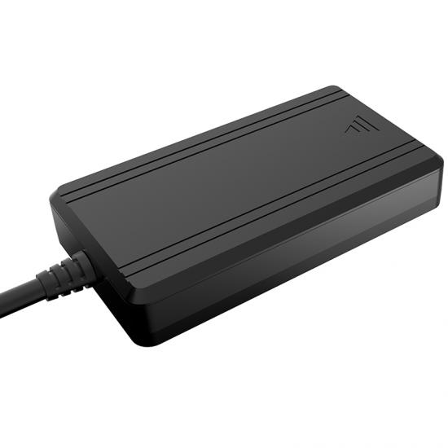

# Huabao - HB-A5M

The HB-A5M is a compact, cost conscious 4G GPS tracker built for straightforward use in private cars, motorcycles, and light commercial vehicles. It combines GPS/BDS positioning with cellular connectivity and a small internal backup battery to provide continuous location reporting, ignition aware telemetry, and basic anti theft controls in a small IP54 rated enclosure.

As a Plaspy compatible device out of the box, the HB-A5M streams location and event data directly into the Plaspy platform so fleets and individual owners can monitor position, voltage, ignition events, and security alarms from a single dashboard. Its design and feature set make it a practical option for organizations that want reliable, low overhead tracking integrated with Plaspy monitoring, alerts, and reporting.

## Key Highlights

- Plaspy compatible for real time tracking and location history across cars and motorcycles
- GPS and BDS positioning combined with dual cellular connectivity for broad coverage
- Ignition detection and relay based remote immobilizer for anti theft workflows
- Wide operating voltage range for flexible vehicle compatibility and low power consumption
- Small internal backup battery to maintain limited standby reporting during power loss
- IP54 enclosure for basic protection against dust and splashes in everyday conditions

## How It Works with Plaspy

When paired with Plaspy, the HB-A5M sends position and status messages to the platform where data is normalized, displayed, and used to trigger rules and reports. Plaspy ingests the tracker telemetry to provide live maps, history playback, alerting, and fleet level dashboards so operators can act on location and event data without managing raw device messages.

- Live location updates and route replay available on Plaspy maps for operational visibility
- Ignition aware data used for trip segmentation, idle and mileage reporting inside the platform
- Relay control events reported to Plaspy to support authorized immobilization and recovery workflows
- Voltage and low battery alerts forwarded to Plaspy to help prevent roadside failures
- Geofence and alarm rules applied at the platform level for automated notifications and escalation

## Typical Use Cases

- Personal vehicle and motorcycle tracking for location visibility and simple theft deterrence
- Small fleet monitoring to track vehicle movements, trips, and basic compliance metrics
- Anti theft response using relay based immobilizer integrated with Plaspy alarm workflows
- Battery and voltage monitoring to reduce unexpected downtime and identify charging issues
- Basic driver oversight where ignition based trip segmentation supports reporting needs

## Why Choose This Tracker with Plaspy

The HB-A5M is a practical choice when you need an affordable, compact tracker that integrates cleanly with Plaspy. Its combination of reliable positioning, ignition awareness, and relay control covers common fleet and security requirements without introducing complex device management. The wide voltage tolerance and low standby draw reduce installation constraints across mixed vehicle types, while remote configuration and OTA updates simplify field maintenance.

Paired with Plaspy, the HB-A5M becomes part of a larger operational toolset for geofencing, alerts, reporting, and event driven workflows. To learn more about how Plaspy supports devices like the HB-A5M and to explore platform capabilities visit https://www.plaspy.com. Product specifications, availability, and manufacturer details can change over time, so please verify current technical information on the official Huabao site https://www.huabaotelematics.com/ before purchase or deployment.
