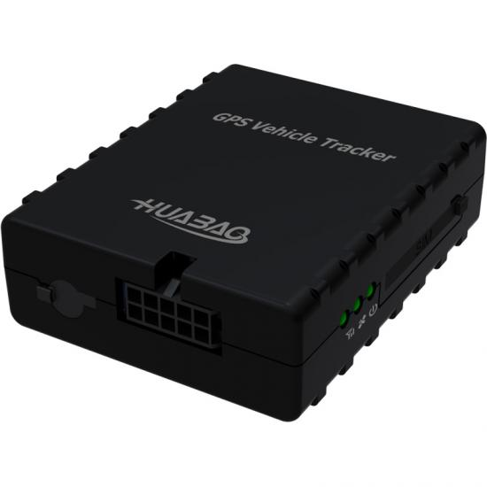

# Huabao - HB-A6

The HB-A6 is a compact, cost effective GPS tracker designed for reliable real time tracking and fleet management. Built for vehicles including cars, rental vehicles, trucks and trailers, the HB-A6 provides continuous GPS and BDS positioning together with ACC ignition detection and multiple alarm inputs to support vehicle security and operational reporting.

As a Plaspy compatible device out of the box, the HB-A6 uses a standard 2G cellular link with a SIM interface to publish location and telemetry to cloud platforms such as Plaspy. Its support for SOS, relay control, audio monitoring via a MIC and an external sensor port make it a practical option for fleet managers and security teams who need timely location, event alerts and basic telemetry in Plaspy dashboards.

## Key Highlights

- Real time GPS and BDS positioning for vehicle location reporting
- ACC ignition detection to support shift and idle monitoring
- SOS input and multiple alarm I O options for security events
- Relay control capability for remote fuel or power cut as part of immobilizer workflows
- Audio monitoring via MIC and a single external sensor port for expanded telemetry
- Compact and cost effective design suitable for concealed or in dash use
- Rugged deployment options available including external battery and weather protected enclosure

## How It Works with Plaspy

Integration with Plaspy is straightforward: the HB-A6 transmits GPS and onboard telemetry over its 2G cellular link to Plaspy where the data is processed for mapping, alerts and reporting. Plaspy receives the device location stream and event flags so fleet teams can monitor movement and respond to incidents.

- Real time location and telemetry updates displayed on Plaspy maps and live views
- ACC ignition status used for driver shift logs, idle time calculations and vehicle usage reports
- Relay based fuel or power cut actions coordinated with Plaspy alarm workflows for immobilization
- SOS alarm messages and audio monitoring surfaced to operations teams for rapid response
- External sensor readings shown alongside location data to support fuel or temperature monitoring

## Typical Use Cases

- Fleet anti theft and immobilization workflows using relay control and Plaspy alerts
- Rental vehicle monitoring with hidden installation, ACC detection and SOS support
- Logistics and trailer tracking with optional rugged enclosures and external battery packs
- Fuel management and tamper detection when paired with an external sensor and Plaspy reports
- Driver safety and incident response using SOS alarms and audio monitoring combined with platform alerts

## Why Choose This Tracker with Plaspy

The HB-A6 offers a practical mix of core vehicle telemetry and event inputs that match common fleet and security workflows supported by Plaspy. Its compact form factor and broad power range make it adaptable across cars, vans and heavier vehicles, while ACC detection, SOS and relay control deliver the basic signals needed for anti theft, immobilizer and operational reporting use cases.

Paired with Plaspy, HB-A6 data becomes part of a centralized fleet view that combines location, alarms and sensor readings into maps, alerts and historical reports. For organizations seeking a cost effective device that provides essential vehicle tracking and security inputs without complex hardware overhead, the HB-A6 is a sensible option to integrate into Plaspy based monitoring and reporting.

To learn more about Plaspy and how compatible devices like the HB-A6 are used on the platform visit https://www.plaspy.com. Product specifications and availability can change over time, so verify current details and official documentation with the manufacturer at https://www.huabaotelematics.com/
