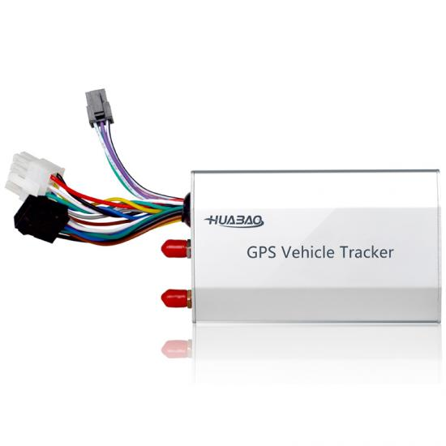

# Huabao - HB-A7

The HB-A7 is a compact, low power GPS tracker designed for professional fleet management and vehicle asset tracking. Built for demanding vehicle environments, it provides continuous location updates and robust telemetry while supporting extensible I O for external peripherals. The device is positioned for regional deployments with 2G and 3G cellular options and dual GNSS positioning, making it suitable for mixed fleets that need reliable tracking and predictable operational behavior.

As a Plaspy compatible device out of the box, the HB-A7 integrates with Plaspy to deliver live maps, alerts and historical playback alongside external sensor data. Its combination of stable positioning, remote control features and flexible I O makes it a practical choice for operators who want to feed detailed telemetry into Plaspy for monitoring, reporting and event driven workflows across logistics, passenger transport and rental fleets.

## Key Highlights

- Plaspy compatible GPS tracker for reliable real time tracking and historical route playback
- Dual GNSS positioning with GPS and BDS for stable location performance in varied conditions
- Selectable 2G or 3G cellular connectivity to match regional network availability
- Multiple inputs and outputs plus serial expansion ports for third party sensors and peripherals
- Remote immobilization and audio snapshot capability to support anti theft and incident verification
- Comprehensive alarm set including ignition detection, SOS and power related alerts
- Compact rugged design suitable for vehicle environments with backup reporting after power loss

## How It Works with Plaspy

When connected to Plaspy, the HB-A7 streams location and telemetry so the platform can display live vehicle positions, trigger rules based alerts and accumulate data for reporting and analysis. Plaspy ingests position fixes, status events and sensor readings from the device to enable operational oversight and automated notifications for fleet teams.

- Real time location updates and track visualization on Plaspy live maps
- Event driven alerts for overspeed, SOS, power cut and ignition changes routed into Plaspy workflows
- Analog and digital sensor telemetry mapped into Plaspy dashboards for fuel and condition monitoring
- Remote immobilizer control and relay actions initiated from Plaspy for anti theft response
- Media and verification support such as photo snapshot and audio events linked to Plaspy incident logs

## Typical Use Cases

- Fleet anti theft and remote immobilization for high value vehicles with Plaspy alerting
- Bus and passenger transport operations requiring continuous tracking and incident verification
- Logistics and distribution fleets needing fuel monitoring, geo fence enforcement and traceability
- Car rental and taxi fleets where ignition detection and event logs improve utilization and loss prevention
- Temperature sensitive or specialized transport using serial connected sensors and Plaspy alarms

## Why Choose This Tracker with Plaspy

The HB-A7 pairs practical hardware flexibility with Plaspy’s real time tracking and reporting capabilities to form a scalable telematics solution. Its support for multiple I O channels and serial expansion allows operators to attach cameras, RFID readers and analog sensors and feed that telemetry into Plaspy for richer operational insight. Remote immobilization, SOS and power related alarms add layers of security while media capture features help validate incidents quickly.

If you are evaluating trackers for a mixed fleet that requires regional cellular options and extensible peripheral support, the HB-A7 is a candidate to consider alongside Plaspy for centralized monitoring, alerts and reporting. Learn more about Plaspy on the main website https://www.plaspy.com. Product specifications and availability can change over time, so please verify current technical details and regional options on the manufacturer site https://www.huabaotelematics.com/ before purchase.
