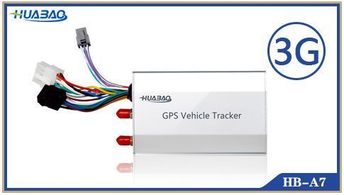

# Huabao - HB-A7 3G

The Huabao HB-A7 3G is a compact vehicle GPS tracker designed for reliable real time positioning and fleet monitoring. It is described as easy to install and engineered for stable performance with low power consumption. Typical capabilities include GPS location reporting, ignition detection, an SOS alarm, and the ability to connect to external peripherals for expanded monitoring and control.

As a Plaspy compatible device, the HB-A7 3G can feed location and alarm data into Plaspy to support fleet visibility and operational monitoring. Its core features such as real time tracking, ignition event reporting, immobilization and external input support make it a practical choice for organizations that want to combine Huabao hardware with Plaspy software for centralized vehicle oversight.

## Key Highlights

- Real time GPS tracking and positioning for continuous vehicle visibility
- Ignition detection to monitor vehicle on off events and usage
- Remote immobilization capability for enhanced theft response and recovery
- SOS alarm input for driver emergency notifications
- Support for external devices including SOS button, relay, listen in microphone, and fuel sensor
- I O and RS232 connectivity for connecting additional peripherals and signal lines

## How It Works with Plaspy

When connected to Plaspy, the HB-A7 3G streams positional updates and alarm signals to the platform so fleet managers can monitor assets and respond to incidents from a single interface. Plaspy aggregates the tracker data to provide operational awareness and historical records.

- Display live vehicle locations on Plaspy maps for routing and oversight
- Receive notifications for ignition on off events and review event history
- Forward SOS alarm alerts into Plaspy notification channels for rapid response
- Use platform controls, where available, to trigger immobilization or relay actions supported by the device
- Monitor external inputs such as fuel or door status through Plaspy dashboards and logs
- Generate activity summaries and alerts to support reporting and operational reviews

## Typical Use Cases

- Logistics fleets requiring continuous position monitoring and operational reports
- Long distance passenger transport for route oversight and driver safety features
- Dangerous goods transport where rapid alerting and incident visibility are important
- Bus companies managing schedules and passenger service vehicles
- Vehicle rental and taxi services needing usage tracking, immobilization options, and emergency alerts

## Why Choose This Tracker with Plaspy

The HB-A7 3G combines practical tracking and safety features with flexible peripheral connectivity, making it suitable for a range of fleet types. Its emphasis on stable performance and low power consumption supports longer term deployments and reduces operational maintenance concerns. Paired with Plaspy, the tracker can contribute to a coherent fleet management workflow by delivering reliable location and event data into a centralized platform.

If you are evaluating devices for integration with Plaspy, the HB-A7 3G is worth considering when you need real time tracking, ignition monitoring, emergency alerts, and the ability to connect external sensors or controls. For more detailed compatibility and deployment planning, learn more about Plaspy on the main website https://www.plaspy.com. Product specifications and availability can change over time, so verify current technical details and accessory support on the manufacturer site https://www.huabaotelematics.com/.
