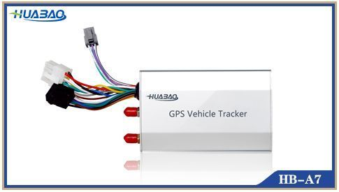

# Huabao - HB-A7B

The Huabao HB-A7B is a versatile GPS tracker designed for commercial vehicle tracking and fleet management. It provides real-time positioning and tracking intended for applications such as logistics, long distance passenger transport, dangerous goods transport, and urban services like buses, taxis, and rental vehicles. The device emphasizes stable performance, straightforward installation, and low power consumption to support continuous operation in diverse fleet environments.

As a Plaspy compatible device, the HB-A7B can feed location and status data into the Plaspy platform to give operators centralized visibility over vehicles and assets. Its support for ignition detection, immobilization, and a range of external inputs such as SOS, relay, listen in microphone, and fuel sensor makes it suitable for safety, security, and operational monitoring when used together with Plaspy's tracking, alerting, and reporting features.

## Key Highlights

- Real time GPS tracking and positioning for continuous vehicle visibility
- Ignition detection and remote immobilization capability for security control
- Support for external accessories including an SOS button and fuel sensor
- I O port connectivity to vehicle signal lines for status inputs
- RS232 connectivity for integration with RFID readers, cameras, or temperature sensors
- Easy installation and low power consumption for practical fleet deployment

## How It Works with Plaspy

When paired with Plaspy, the HB-A7B supplies location and event data to the Plaspy platform so fleet managers can monitor vehicles and respond to incidents from a single interface. Plaspy can display positions, manage alerts, and produce operational reports using the incoming data from compatible trackers.

- Live location display and map tracking of HB-A7B equipped vehicles in Plaspy
- Event and status reporting such as ignition on off and SOS activations
- Immobilization and remote command status reflected in device controls when configured
- Input mapping for external devices so Plaspy can surface fuel sensor or other accessory events
- Route history and trip playback for operational review and compliance reporting

## Typical Use Cases

- Long haul logistics fleets needing reliable position updates and operational oversight
- Passenger transport operators and bus companies monitoring routes and vehicle status
- Dangerous goods transport where security and remote immobilization are desirable
- Vehicle rental and taxi companies that require theft prevention and quick incident response
- Fleets that use external sensors or accessories for fuel monitoring or driver safety alerts

## Why Choose This Tracker with Plaspy

The HB-A7B is a practical choice for organizations that need a balance of core tracking functions and support for a range of external devices. Its combination of real time positioning, ignition status monitoring, and accessory compatibility makes it suitable for mixed fleets and transport use cases where both location awareness and specific vehicle signals matter. Using the device with Plaspy helps consolidate those data streams into a single operational view, improving situational awareness and simplifying fleet oversight.

Because available product information can be concise, teams should consider their specific requirements for accessory integration and command control when evaluating this tracker. Plaspy can act as the central platform to translate HB-A7B data into actionable insights, alerts, and reports to support daily operations.

To learn more about Plaspy and how compatible devices like the HB-A7B integrate into our fleet management platform visit https://www.plaspy.com. Product specifications and availability can change over time, so please verify current technical details and accessory compatibility on the manufacturer site https://www.huabaotelematics.com/.
