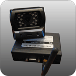

# HunterPro - CP60-KAM

The HunterPro CP60-KAM is a cutting-edge GPS tracker that combines advanced technology with the reliable functionalities that HunterPro is known for. With this tracker, you can now capture images from the monitored vehicle without any additional cost to your service. This innovative feature allows you to have visual evidence of the vehicle's surroundings, providing you with an extra layer of security and peace of mind.

One of the standout features of the CP60-KAM is its ability to automatically capture an image when a Panic Event is detected. This means that in the event of an emergency or distress situation, you will have a visual record of what is happening, which can be invaluable for both personal and commercial use. Whether you are monitoring a fleet of vehicles or keeping an eye on your personal vehicle, the CP60-KAM ensures that you have the information you need when it matters most.

With its advanced technology and reliable functionalities, the HunterPro CP60-KAM is the perfect GPS tracker for those who prioritize safety and security. Whether you are a business owner looking to protect your assets or an individual wanting to keep your vehicle safe, the CP60-KAM has you covered. Trust in HunterPro's expertise and choose the CP60-KAM for all your tracking needs.

