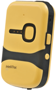

# Intellitrack - Intellitrac P1

The Intellitrac P1 from Intellitrack is a compact personal GPS device designed for discreet tracking of individuals and portable assets. It features a small, mobile form factor intended to be easy to carry or conceal, a waterproof enclosure for use in varied conditions, and onboard capabilities for detecting motion and height changes to enhance situational awareness.

As a Plaspy compatible device, the Intellitrac P1 can feed location and activity data into Plaspy's fleet and personnel monitoring platform. Its durable construction and internal backup battery support ongoing visibility, making it a practical choice for organizations that need reliable, discreet tracking combined with Plaspy's reporting and alerting tools.

## Key Highlights

- Compact and mobile design suited to personal tracking and portable asset monitoring
- Waterproof enclosure for reliable operation in wet or variable environments
- Internal backup battery to maintain tracking connectivity for multiple days
- Built in accelerometer and barometer provide motion and height change detection
- Internal antenna for GPS and GSM connections for location reporting
- Sleek form factor that supports discreet carry and unobtrusive monitoring

## How It Works with Plaspy

When used with Plaspy, the Intellitrac P1 provides continuous location updates and motion signals that Plaspy aggregates for real time visibility, alerts, and historical reporting. Plaspy can present device position, recent movement, and basic activity indicators to help teams manage safety and operations.

- Display live location and recent track history inside the Plaspy platform
- Generate movement or inactivity alerts based on the tracker motion signals
- Include height change information in activity summaries and reports
- Centralize multiple Intellitrac P1 devices alongside other trackers for unified monitoring
- Use Plaspy reporting to analyze patterns and support operational oversight

## Typical Use Cases

- Discreet personal tracking for lone workers or vulnerable individuals
- Employee whereabouts monitoring during field operations or special assignments
- Temporary or portable asset tracking where concealment and mobility matter
- Safety oversight for staff working in variable weather or outdoor conditions
- Short term deployments requiring rugged, compact tracking devices

## Why Choose This Tracker with Plaspy

The Intellitrac P1 is a practical option for organizations that need a small, durable device for person centric or portable asset tracking. Its waterproof enclosure and backup battery help sustain tracking in real world conditions, while motion and height change detection provide useful signals that Plaspy can use for alerts and activity summaries. Because the device is compact and discreet, it fits use cases where low profile monitoring is important.

If you are evaluating trackers for use with Plaspy, the Intellitrac P1 pairs physical durability and compact design with straightforward location and motion reporting. To learn more about how Plaspy can work with devices like the Intellitrac P1 visit https://www.plaspy.com. Product specifications and availability can change over time, so for the most current technical details please verify with the manufacturer at https://www.systech-iot.com/
