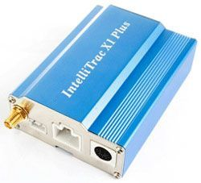

# Intellitrack - Intellitrac X1 Plus

The Intellitrack Intellitrac X1 Plus is a compact GPS tracker designed to monitor vehicles and valuable assets without drawing attention. Its small form factor and a suite of standard tracking features make it suitable for discreet installation on vehicles, equipment, or other items that require regular position updates and status monitoring.

As a device compatible with Plaspy, the Intellitrac X1 Plus can provide location and status data into the Plaspy platform for centralized visibility and fleet oversight. Its support for multiple communication methods and remote configuration capabilities means it can be integrated into Plaspy workflows to support real time tracking, geofence alerts, and operational reporting.

## Key Highlights

- Compact size that enables discreet placement on vehicles and assets
- Multiple communication options including SMS CS Data and GPRS TCP UDP and optional voice for flexible connectivity
- Remote configuration and support for remote firmware upgrades to keep settings and behavior current
- Configurable tracking modes with time based distance based and intelligent options to balance detail and data usage
- Geo fencing control for virtual boundaries and related alerts
- Power management with low power and power lost alarms plus a back up battery that provides more than three days of reserve operation
- Additional security features such as GPS antenna disconnect alarm and optional external barcode reader support

## How It Works with Plaspy

When paired with Plaspy, the Intellitrac X1 Plus feeds location and status information into a centralized platform for monitoring and reporting. Plaspy can surface the tracker data alongside other fleet assets and use the device signals to generate alerts and operational insights.

- Real time location display and history visualization within Plaspy for route review and oversight
- Geofence alerting so Plaspy can notify users when assets enter or exit defined areas
- Battery and power loss alerts routed to Plaspy to help manage device uptime and maintenance
- Use of configurable tracking modes to tune reporting frequency and improve operational efficiency in Plaspy dashboards
- Remote configuration and firmware update workflows where supported to maintain device settings through compatible management paths

## Typical Use Cases

- Discreet vehicle tracking for fleet visibility and theft deterrence
- Equipment monitoring on construction or rental sites to track asset utilization
- Security and recovery for high value assets that require location alerts and power loss detection
- Delivery and logistics oversight to review routes and confirm asset locations
- Rental fleet control where geofencing and remote status updates support operational rules

## Why Choose This Tracker with Plaspy

The Intellitrac X1 Plus is a practical choice for organizations that need a small, capable tracker that integrates into a broader fleet management platform like Plaspy. Its combination of multiple communication options, configurable tracking modes, geofencing, and power management features helps teams tailor monitoring to their operational and security needs while keeping devices manageable across a fleet.

Because Plaspy centralizes location, alerting, and reporting, using the Intellitrac X1 Plus with Plaspy can simplify oversight for mixed fleets and diverse asset types. If precise integration behavior or advanced management features are critical for your deployment, review device and platform settings to confirm the exact workflows you need.

To learn more about Plaspy and how compatible devices can support your fleet operations visit https://www.plaspy.com. Product specifications, availability, and manufacturer details can change over time so please verify current technical information on the manufacturer site https://www.systech-iot.com/ before purchase or deployment.
