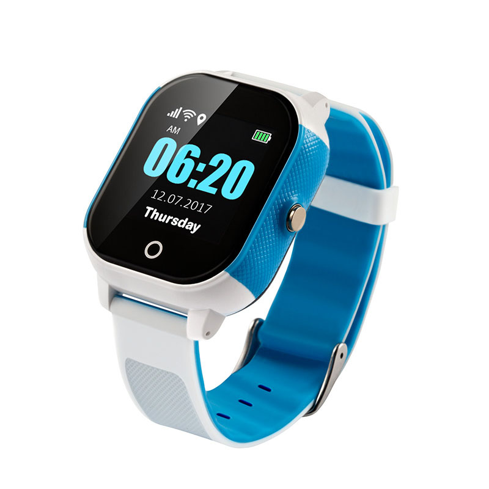

# iStartek - PT23

The PT23 Kids Watch GPS Tracker by iStartek is a compact wearable designed for child safety and everyday use. It combines multi mode positioning (GPS and Beidou, Wi‑Fi and LBS), two way voice, SOS calling and smart geo fence alerts in a small IP67 waterproof package with a 1.30" display. The device is built for active wear and provides real time location and status updates that are appropriate for parents, schools and caregivers.

As a Plaspy compatible device out of the box, the PT23 can be integrated into Plaspy monitoring dashboards and reporting workflows without complex configuration. That compatibility makes it straightforward to view live location, receive safety alerts, and review historical routes within Plaspy so families and operators can maintain situational awareness and respond quickly to events.

## Key Highlights

- Plaspy compatible kids watch offering real time tracking and safety alerts via app web and SMS delivery.
- Multi mode positioning for broader coverage using GPS and Beidou plus Wi‑Fi and LBS as additional location sources.
- Two way voice communication and a dedicated SOS button for direct contact and emergency notification.
- Rugged everyday design with IP67 water protection and a lightweight form factor suitable for children.
- Historical route playback up to three months and smart geo fence alerts for arrival and departure monitoring.
- Configurable reporting and alert triggers including time distance and low battery notifications.

## How It Works with Plaspy

When used with Plaspy the PT23 streams location and status messages to Plaspy compatible endpoints so operators can monitor devices on live maps and trigger notifications. Plaspy ingests the device messages and presents them as actionable items in dashboards and reports, helping parents and administrators track movement and respond to alerts.

- Real time location updates and device status appear on Plaspy maps and device lists for instant visibility.
- SOS events and alarm conditions surface as priority notifications within Plaspy workflows for fast response.
- Two way voice and remote monitoring are available for direct communication linked to the device entry in Plaspy.
- Historical route playback and geo fence history allow retrospective review and attendance confirmation inside Plaspy.
- Configurable alerts for time distance mileage and low battery help automate notifications and reduce manual checks.

## Typical Use Cases

- Child safety and parental monitoring for everyday travel playgrounds and school pickup routines.
- School routing and attendance verification with geo fence alerts for arrival and departure zones.
- Emergency response and caregiver notification using the SOS button and voice monitoring for situational assessment.
- Short term wearable asset tracking where a small durable form factor and simple monitoring are required.
- Routine check ins and location reporting for youth programs camps and supervised activities.

## Why Choose This Tracker with Plaspy

The PT23 is a practical wearable tracker when the primary need is reliable child centered location and safety monitoring. Its combination of multi mode positioning, voice capability and durable design makes it well suited to environments where visibility and simple communications are essential. Integrating the PT23 with Plaspy brings those device events into a centralized platform for mapping alerts and historical review without excessive setup.

If you want to explore how the PT23 can fit into your monitoring workflows learn more about Plaspy on the main website https://www.plaspy.com. Product specifications availability and manufacturer details can change over time so please verify current specifications and support information on the official iStartek website https://istartek.com/.
